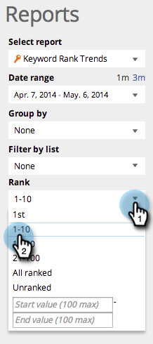

# SEO - 키워드 트렌드 보고서 활용 {#seo-use-the-keyword-trends-report}

이 보고서에서 시간이 지남에 따라 키워드에 어떻게 순위가 매겨졌는지 확인할 수 있습니다.

>[!IMPORTANT]
>
>2026년 3월 31일에 Marketo Engage은 검색 엔진 최적화 기능을 사용하지 않습니다. 3월 30일 이전에 관련 데이터를 내보내십시오. [자세히 알아보기](https://nation.marketo.com/t5/product-blogs/marketo-engage-seo-feature-deprecation/ba-p/359060){target="_blank"}
>
>* [내보내기 문제](https://experienceleague.adobe.com/ko/docs/marketo/using/product-docs/additional-apps/seo/pages/seo-export-issues-to-csv){target="_blank"}
>* [키워드 결과 내보내기](https://experienceleague.adobe.com/ko/docs/marketo/using/product-docs/additional-apps/seo/keywords/seo-exporting-keyword-results){target="_blank"}
>* [키워드 트렌드 내보내기](https://experienceleague.adobe.com/ko/docs/marketo/using/product-docs/additional-apps/seo/reports/seo-use-the-keyword-trends-report#exporting-data){target="_blank"}
>* [경쟁업체 키워드 트렌드 내보내기](https://experienceleague.adobe.com/ko/docs/marketo/using/product-docs/additional-apps/seo/reports/seo-use-the-competitor-kw-trends-report#exporting-data){target="_blank"}

## 보고서 로드 {#load-report}

1. **[!UICONTROL Reports]**(으)로 이동합니다.

   

1. **[!UICONTROL Keyword Rank Trends]**&#x200B;을(를) 클릭합니다.

   

   여기 있습니다.

   

   설명된 보고서 항목:

   | 항목 | 설명 |
   |---|---|
   | [!UICONTROL Keywords] | 추적 중인 키워드의 수입니다. |
   | [!UICONTROL Ranking URLs] | 설정한 범위에서 사이트 순위의 URL 수입니다. |
   | [!UICONTROL Avg. rank] | 설정한 범위 내 키워드의 평균 등급입니다. |
   | [!UICONTROL Avg. searches] | 설정한 범위(최근 30일) 동안 발생한 해당 키워드에 대한 Google 미국 검색의 평균 검색 수입니다 |

## 데이터 필터링 {#filtering-data}

1. 드롭다운을 클릭하고 원하는 기간을 선택합니다.

   

1. Rank 드롭다운을 클릭하여 키워드를 보려는 등급 범위를 선택합니다.

   

## 데이터 내보내기 {#exporting-data}

1. **[!UICONTROL Export CSV]** 또는 **[!UICONTROL Export PDF]**&#x200B;를 클릭합니다.

   

키워드 순위에서 경쟁업체와 어떻게 비교되는지 확인할 수도 있습니다.

>[!NOTE]
>
>[경쟁사 KW 등급 트렌드 보고서 사용](/help/marketo/product-docs/additional-apps/seo/reports/seo-use-the-competitor-kw-trends-report.md)
