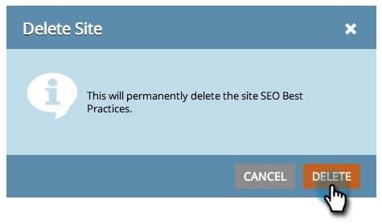

# SEO - 사이트 추가/사이트 삭제 {#seo-add-a-site-delete-a-site}

Marketing에서 사이트의 페이지와 관련된 데이터(인바운드 링크 및 권장 사항)를 가져오기 위해서는 여기에서 사이트의 URL을 정의해야 합니다.

>[!NOTE]
>
>**가용성**
>
>모든 고객이 이 기능을 구입하지는 않았습니다. 자세한 내용은 영업 담당자에게 문의하십시오.

## 사이트 추가 {#add-a-site}

1. 관리 드롭다운을 클릭하고 관리자를 **선택합니다**.

   >[!NOTE]
   >
   >**관리자 권한 필요**

   

1. 사이트 **추가를 클릭합니다**.

   

1. 이름, **웹 사이트 URL을** 입력하고 **저장을 클릭합니다**.

   >[!TIP]
   >
   >또한** ****블로그 URL이 있는 경우 추가할** 수 있습니다.

   

   좋아요! 방금 다른 사이트를 추가했습니다.

   

## 사이트 삭제 {#delete-a-site}

둘 이상의 사이트를 추적하는 경우 더 이상 최적화에 관심이 없는 사이트를 삭제할 수도 있습니다.

1. 관리 드롭다운을 클릭하고 관리자를 **선택합니다**.

   

1. 제거할 사이트를 클릭합니다.

   

1. 삭제를 **클릭합니다**.

   
삭제를 확인합니다.
   

   >[!NOTE]
   >
   >둘 이상의 사이트가 있는 경우에만 사이트를 삭제할 수 있습니다. 단 하나의 사이트가 있는 경우 사이트를 선택하고 재설정을 클릭하여 재설정을 수행할 수 **있습니다**. 사이트를 재설정하면 모든 사이트 데이터 *가* 삭제되고 사이트가 다시 생성됩니다.

