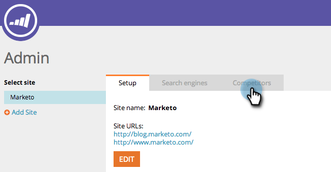

# SEO - 경쟁업체 {#seo-add-competitors} 추가

경쟁업체를 추가하면 모니터링하기로 선택한 동일한 키워드 및 인바운드 링크에 대해 경쟁자가 수행하는 방식을 추적할 수 있습니다.

>[!NOTE]
>
>**관리자 권한 필요**

1. **관리** 섹션으로 이동합니다.

   

1. **경쟁업체** 탭을 클릭합니다.

   

1. **경쟁업체 추가**&#x200B;를 클릭합니다.

   

1. 경쟁자의 **이름** 및 **URL**&#x200B;을 입력합니다.

   

   하이 파이브! 이제 목록에 경쟁자가 표시됩니다.

   

   축하합니다! 당신은 그것을 완전히 부수는데 한 걸음 더 가까이 있습니다.

   >[!NOTE]
   >
   >**관련 문서**
   >
   >    
   >    
   >    * [키워드 추가](../../../../product-docs/additional-apps/seo/keywords/seo-add-keywords.md)
   >    * [키워드 이해(경쟁업체 보기)](../../../../product-docs/additional-apps/seo/keywords/seo-understanding-keywords.md)

