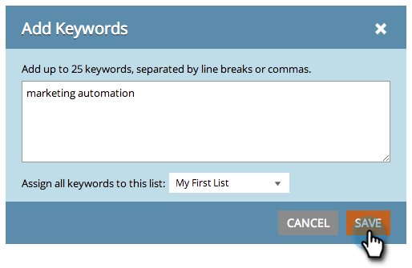

# SEO - 목록 관리 {#seo-managing-lists}

키워드, 페이지, 페이지 문제 또는 인바운드 링크를 추가할 때 목록에 항목을 추가할 수 있습니다. 목록은 체계적으로 구성되어 있으며 보고서를 필터링하여 해당 목록의 데이터만 볼 수 있도록 해 줍니다. 만드는 방법은 다음과 같습니다.

1. **[!UICONTROL 키워드 추가]**&#x200B;를 클릭합니다.

   >[!NOTE]
   >
   >페이지, 페이지 문제 및 인바운드 링크를 추가할 때와 동일한 방식으로 작동합니다.

   

1. 키워드를 입력합니다. 드롭다운에서 추가할 목록을 선택합니다.

   

   >[!TIP]
   >
   >드롭다운에서 새 목록을 만들 수 있습니다. 제목을 입력하고 반환 키를 누릅니다.

1. **[!UICONTROL 저장]**&#x200B;을 클릭합니다.

   
