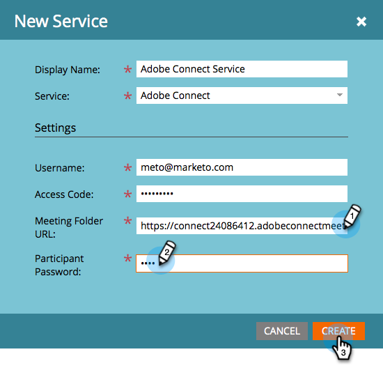

# LaunchPoint 서비스로 Adobe Connect 추가 {#add-adobe-connect-as-a-launchpoint-service}

Adobe Connect 웨비나 등록 및 참석을 관리하는 Marketing Cloud

>[!NOTE]
>
>**관리자 권한 필요**

>[!NOTE]
>
>**미리 알림**
>
>이 단계를 수행하려면 기존 Adobe Connect 및 관리 권한 구독이 필요합니다. 다음 설정을 사용하십시오.사용자 이름, 암호, 참가자 암호 및 회의 폴더 URL.

>[!NOTE]
>
>Adobe Connect 온사이트는 현재 지원되지 않습니다.

1. 관리자로 **이동하고 LaunchPoint** 를 **클릭합니다**.

   

1. [ **새로** 만들기]를 선택한 다음 **새 서비스를 선택합니다**.

   

1. 표시 **이름을 입력합니다**. 서비스 **에서** Adobe Connect을 선택합니다.

   

1. 사용자 **이름** 및 **액세스 코드를 입력합니다**.

   

1. 회의 폴더 URL **및** 참가자 **** 암호 **를**&#x200B;입력한 **다음** Create*를클릭하여 프로세스를 완료합니다.**

   ** 

   **

   >[!TIP]
   >
   >참가자 암호를 만들면 이벤트를 위해 링크를 보낼 때 선택한 값이 쿼리 문자열에 포함됩니다. 따라서 고객에게 적합한 제품을 제안합니다.

   >[!NOTE]
   >
   >**예**
   >
   >
   >Adobe Connect 계정에 로그인한 후에는 [세미나] **탭을** 선택합니다. 특정 세미나로 드릴다운하지 않고 브라우저 막대의 URL을 [ **회의 폴더 URL]**&#x200B;설정으로 복사합니다&#x200B;**.**

1. 경이롭네! 이제 **Adobe Connect** 서비스가 Marketing To와 동기화됩니다.

   

>[!MORELIKETHIS]
>
>Adobe Connect에서 [이벤트를 만드는 방법을 알아봅니다](../../../product-docs/demand-generation/events/create-an-event/create-an-event-with-adobe-connect.md).

