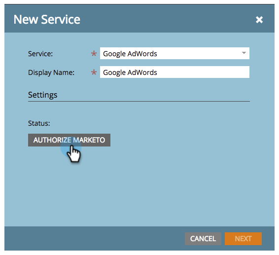
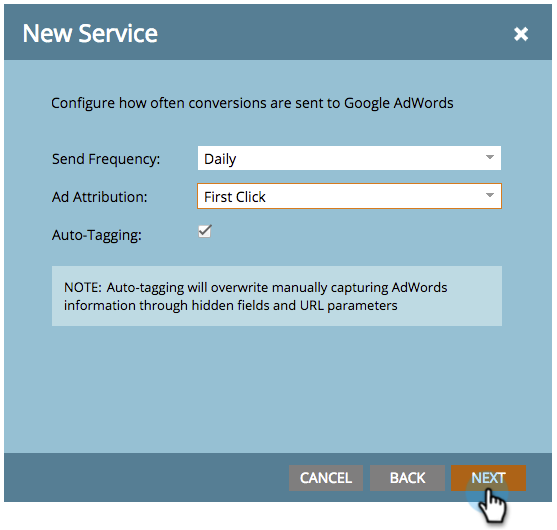

# 관리자 계정 {#add-google-adwords-as-a-launchpoint-service-with-a-manager-account}을(를) 사용하여 Google AdWords를 Launchpoint 서비스로 추가

Google AdWords 계정을 Marketing에 연결하여 Marketing에서 Google AdWords로 오프라인 전환 데이터를 자동으로 업로드합니다. 그런 다음 AdWords에 [사용자 지정 열](https://support.google.com/adwords/answer/3073556)을 추가한 후 AdWords UI에서 자격이 있는 리드, 기회 및 신규 고객(또는 추적하고자 하는 모든 매출 단계)이 발생한 클릭을 쉽게 확인할 수 있습니다. 이 정보는 마케팅 UI에 표시되지 않습니다.

Google Adwords 계정이 여러 개 있는 경우 [Google AdWords Manager 계정](https://www.google.com/adwords/manager-accounts/)(이전 내 클라이언트 센터)을 사용하여 Marketing과 통합할 수 있습니다.

[Google의 오프라인 변환 가져오기 기능에 대해 자세히 알아보십시오](https://support.google.com/adwords/answer/2998031?hl=en).

>[!NOTE]
>
>**관리자 권한 필요**

>[!NOTE]
>
>또한 [독립 실행형 Google AdWords 계정을 Launchpoint 서비스](add-google-adwords-as-a-launchpoint-service.md)로 통합할 수도 있습니다.

1. **관리** 섹션으로 이동합니다.

   

1. **LaunchPoint**&#x200B;를 선택합니다.

   

1. **새로 만들기** 및 **새 서비스**&#x200B;를 선택합니다.

   

1. 표시 이름을 입력하고 **Google AdWords**&#x200B;를 선택합니다.

   

1. **마케팅 승인**&#x200B;을 선택합니다.

   >[!NOTE]
   >
   >개인 Gmail 계정에서 로그아웃하고 팝업을 활성화해야 합니다.

   

1. **Google AdWords**&#x200B;와 연결된 계정을 선택합니다.

   

1. **수락**&#x200B;을 선택합니다.

   

1. 상태는 **성공**&#x200B;으로 표시됩니다. **다음**&#x200B;을 선택합니다.

   

1. Marketing에서 Google AdWords **Weekly ** 또는 **Daily**&#x200B;로 오프라인 전환을 업로드합니다.

   

1. **첫 번째 클릭** 또는 **마지막 클릭**&#x200B;으로의 특성 변환.

   | 유형 | 정의 |
   |---|---|
   | 첫 번째 클릭 | 오프라인 전환은 지난 90일 동안 사용자가 클릭한 첫 번째 AdWords에 적용됩니다 |
   | 마지막 클릭 | 오프라인 전환은 사용자가 클릭한 마지막 AdWords 및 |

   

   >[!NOTE]
   >
   >[이 ](https://support.google.com/adwords/answer/1752125?hl=en) 기능이 작동하려면 자동 태그를 선택해야 합니다. AdWords 내에서 활성화해야 합니다.

1. **다음**&#x200B;을 클릭합니다.

   

1. 업데이트하지 않으려는 계정의 선택을 취소합니다. **만들기**&#x200B;를 클릭합니다.

   

   야호! 이제 매출 모델에서 AdWords 오프라인 전환을 매핑하는 방법은 아래 관련 문서를 참조하십시오.

   >[!NOTE]
   >
   >**관련 문서**
   >
   >    
   >    
   >    * [관리자 계정으로 매출 모델에서 Google AdWords 전환 설정](../../../product-docs/reporting/revenue-cycle-analytics/revenue-cycle-models/set-google-adwords-conversions-in-the-revenue-model-with-a-manager-account.md)

