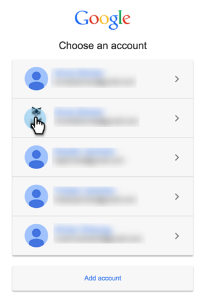

# 관리자 계정을 사용하여 [!DNL Google AdWords]을(를) [!DNL Launchpoint] 서비스로 추가 {#add-google-adwords-as-a-launchpoint-service-with-a-manager-account}

[!DNL Google AdWords] 계정을 Marketo에 연결하여 Marketo에서 [!DNL Google AdWords]&#x200B;(으)로 오프라인 전환 데이터를 자동으로 업로드합니다. [!DNL AdWords]에서 [사용자 지정 열을 추가](https://support.google.com/adwords/answer/3073556){target="_blank"}한 후 [!DNL AdWords] UI에서 자격 있는 리드, 기회 및 신규 고객(또는 추적하려는 매출 단계)을 일으킨 클릭 수를 쉽게 확인할 수 있습니다. 이 정보는 Marketo UI에 표시되지 않습니다.

[!DNL Google Adwords] 계정이 여러 개 있는 경우 [[!DNL Google AdWords Manager Account]](https://www.google.com/adwords/manager-accounts/){target="_blank"}(이전의 [!DNL My Client Center])을(를) 사용하여 Marketo과 통합할 수 있습니다.

[Google의 오프라인 전환 가져오기 기능](https://support.google.com/adwords/answer/2998031?hl=en){target="_blank"}에 대해 자세히 알아보세요.

>[!AVAILABILITY]
>
>모든 Marketo Engage 사용자가 이 기능을 구입한 것은 아닙니다. 자세한 내용은 Adobe 계정 팀(계정 관리자)에 문의하십시오.

>[!NOTE]
>
>**관리자 권한 필요**

>[!NOTE]
>
>[독립형 [!DNL Google AdWords] 계정을  [!DNL Launchpoint] 서비스](/help/marketo/product-docs/administration/additional-integrations/add-google-adwords-as-a-launchpoint-service.md){target="_blank"}(으)로 통합할 수도 있습니다.

1. **[!UICONTROL Admin]** 영역으로 이동합니다.

   

1. **[!UICONTROL LaunchPoint]**&#x200B;를 선택합니다.

   

1. **[!UICONTROL New]** 드롭다운을 클릭하고 **[!UICONTROL New Service]**&#x200B;를 선택합니다.

   

1. **[!UICONTROL Display Name]**&#x200B;을(를) 입력하고 **[!UICONTROL Google AdWords]**&#x200B;을(를) 선택하십시오.

   

1. **[!UICONTROL Authorize Marketo]**&#x200B;를 선택합니다.

   >[!NOTE]
   >
   >개인 [!DNL Gmail] 계정에서 로그아웃하고 팝업을 사용하도록 설정하십시오.

   

1. **[!DNL Google AdWords]**&#x200B;과(와) 연결된 계정을 선택하십시오.

   

1. **[!UICONTROL Accept]**&#x200B;를 클릭합니다.

   

1. 상태가 **[!UICONTROL Success]**(으)로 표시됩니다. **[!UICONTROL Next]**&#x200B;를 선택합니다.

   

1. Marketo에서 [!DNL Google AdWords] **[!UICONTROL Weekly]** 또는 **[!UICONTROL Daily]**(으)로 오프라인 전환을 업로드합니다.

   

1. **[!UICONTROL First Click]** 또는 **[!UICONTROL Last Click]**(으)로 특성을 전환했습니다.

   

   | 유형 | 정의 |
   |---|---|
   | [!UICONTROL First Click] | 오프라인 전환은 지난 90일 동안 한 사람이 클릭한 첫 번째 [!DNL AdWords] 광고로 인한 것입니다. |
   | [!UICONTROL Last Click] | 오프라인 전환은 사용자가 클릭한 마지막 [!DNL AdWords] 광고로 인한 것입니다. |

   >[!NOTE]
   >
   >이 기능을 사용하려면 [자동 태그 지정](https://support.google.com/adwords/answer/1752125?hl=en){target="_blank"}을 선택해야 합니다. [!DNL AdWords] 내에서 활성화되어야 합니다.

1. **[!UICONTROL Next]**&#x200B;를 클릭합니다.

   

1. 업데이트하지 않으려는 계정의 선택을 취소합니다. **[!UICONTROL Create]**&#x200B;를 클릭합니다.

   

   이제 매출 모델에서 [!DNL AdWords] 오프라인 전환을 매핑하는 방법에 대해서는 아래 관련 문서를 참조하십시오.

   >[!MORELIKETHIS]
   >
   >관리자 계정을 사용하여 [수익 모델에서 전환 설정 [!DNL Google AdWords] 2&rbrace;](/help/marketo/product-docs/reporting/revenue-cycle-analytics/revenue-cycle-models/set-google-adwords-conversions-in-the-revenue-model-with-a-manager-account.md){target="_blank"}
