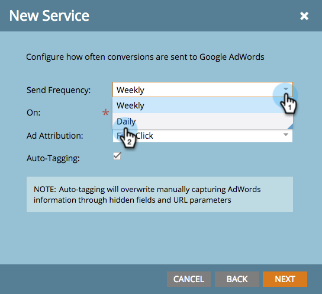

# 관리자 계정을 사용하여 Google AdWords를 Launchpoint 서비스로 추가 {#add-google-adwords-as-a-launchpoint-service-with-a-manager-account}

Google AdWords 계정을 Marketo에 연결하여 Marketo에서 Google AdWords로 오프라인 전환 데이터를 자동으로 업로드합니다. 그런 다음 AdWords UI에서 자격 조건을 갖춘 리드, 기회 및 신규 고객(또는 추적하려는 모든 수익 단계)이 발생한 클릭을 손쉽게 확인할 수 있습니다  [사용자 지정 열 추가](https://support.google.com/adwords/answer/3073556)AdWords의 {target=&quot;_blank&quot;}. 이 정보는 Marketo UI에 표시되지 않습니다.

Google Adwords 계정이 여러 개 있는 경우 [Google AdWords Manager 계정](https://www.google.com/adwords/manager-accounts/){target=&quot;_blank&quot;}(이전의 내 클라이언트 센터)를 사용하여 Marketo과 통합할 수 있습니다.

추가 정보 [Google의 오프라인 전환 가져오기 기능](https://support.google.com/adwords/answer/2998031?hl=en){target=&quot;_blank&quot;}.

>[!AVAILABILITY]
>
>모든 고객이 이 기능을 구입한 것은 아닙니다. 자세한 내용은 고객 성공 관리자에게 문의하십시오.

>[!NOTE]
>
>**관리 권한 필요**

>[!NOTE]
>
>을 통합할 수도 있습니다 [Launchpoint 서비스로서의 독립형 Google AdWords 계정](/help/marketo/product-docs/administration/additional-integrations/add-google-adwords-as-a-launchpoint-service.md){target=&quot;_blank&quot;}.

1. 로 이동합니다. **관리** 섹션을 참조하십시오.

   

1. 선택 **LaunchPoint**.

   

1. 을(를) 클릭합니다. **새로 만들기** 드롭다운 및 선택 **새 서비스**.

   

1. 표시 이름을 입력하고 을 선택합니다 **Google AdWords**.

   

1. 선택 **Marketo 권한 부여**.

   >[!NOTE]
   >
   >개인 Gmail 계정에서 로그아웃하고 팝업을 활성화해야 합니다.

   

1. 연결된 계정을 선택합니다 **Google AdWords**.

   

1. 클릭 **수락**.

   

1. 상태가 **성공**. 선택 **다음**.

   

1. Marketo에서 Google AdWords로 오프라인 전환 업로드 **주별** 또는 **일별**.

   

1. 으로의 속성 전환 **첫 번째 클릭** 또는 **마지막 클릭**.

   

   | 유형 | 정의 |
   |---|---|
   | 첫 번째 클릭 | 오프라인 전환은 지난 90일 동안 사용자가 클릭한 첫 번째 AdWords에 귀속됩니다 |
   | 마지막 클릭 | 오프라인 전환은 사용자가 클릭한 마지막 AdWords에 귀속됩니다 |

   >[!NOTE]
   >
   >[자동 태깅](https://support.google.com/adwords/answer/1752125?hl=en)이 기능을 사용하려면 {target=&quot;_blank&quot;}을 선택해야 합니다. AdWords 내에서 활성화되어야 합니다.

1. 클릭 **다음**.

   

1. 업데이트하지 않으려는 계정의 선택을 취소합니다. 클릭 **만들기**.

   

   이제 매출 모델에서 AdWords 오프라인 전환을 매핑하는 방법에 대해서는 아래 관련 문서를 참조하십시오.

   >[!MORELIKETHIS]
   >
   >[관리자 계정을 사용하여 매출 모델에서 Google AdWords 전환 을 설정합니다](/help/marketo/product-docs/reporting/revenue-cycle-analytics/revenue-cycle-models/set-google-adwords-conversions-in-the-revenue-model-with-a-manager-account.md){target=&quot;_blank&quot;}
