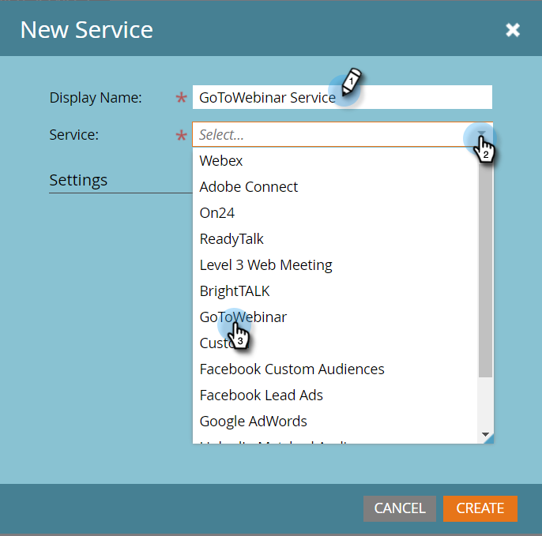

# LaunchPoint 서비스로 GoToWebinar 추가 {#add-gotowebinar-as-a-launchpoint-service}

Marketing에서 GoToWebinar 등록 및 참석을 관리합니다.

>[!NOTE]
>
>**관리자 권한 필요**

>[!NOTE]
>
>**미리 알림**
>
>이 단계를 수행하려면 GoToWebinar 및 관리 권한에 대한 기존 구독이 필요합니다. 지금 GoToWebinar에 로그인하는 데 사용하는 이메일 및 암호를 가지고 있어야 합니다.

>[!NOTE]
>
>GoToMeeting, GoToWebcast 및 GoToTraining은 현재 지원되지 않습니다.

1. 관리자로 **이동하고** LaunchPoint를 **선택합니다**.

   

1. [ **신규** 및 **새 서비스]를 선택합니다**.

   

1. `Enter a **Display Name**. Under **Service**, select`**GoToWebinar**.

   

1. 그런 다음 **GoTo** Webinar에 **로그인을 클릭합니다**.

   

   >[!NOTE]
   >
   >마케팅 양식의 회사 이름 및 작업 제목을 GoToWebinar로 동기화하려면 추가 필드 **활성화** 상자를 선택합니다.

1. [GoToWebinar 로그인] 팝업 창에서 **GoToWebinar** 이메일 및 암호를 입력하고 **로그인을 클릭합니다**.

   

1. 창을 닫은 후 **만들기를 클릭합니다**.

   

1. 좋아요! 이제 **GoToWebinar** 계정이 Marketing To와 동기화됩니다.

   

>[!CAUTION]
>
>GoToWebinar에서 암호를 업데이트할 때는 Marketing Cloud에서도 암호를 업데이트해야 합니다.

>[!NOTE]
>
>**관련 문서**
>
>GotoWebinar로 이벤트 [를 만드는 방법을 알아봅니다](../../../product-docs/demand-generation/events/create-an-event/create-an-event-with-gotowebinar.md).

