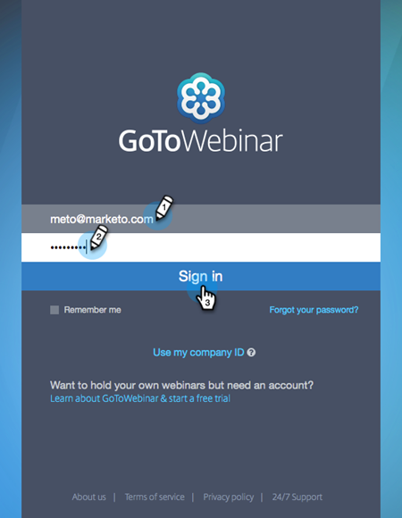

# LaunchPoint 서비스로 GoToWebinar 추가 {#add-gotowebinar-as-a-launchpoint-service}

Marketo은 GoToWebinar 등록 및 참여를 관리합니다.

>[!NOTE]
>
>**관리 권한 필요**

>[!NOTE]
>
>이 단계에서는 GoToWebinar 및 관리 권한에 대한 기존 구독이 필요합니다. GoToWebinar에 로그인하는 데 사용할 이메일과 암호가 있는지 확인합니다.

>[!NOTE]
>
>GoToMeeting, GoToWebcast 및 GoToTraining은 현재 지원되지 않습니다.

1. 로 이동합니다. **관리** 영역.

   

1. 클릭 **LaunchPoint**.

   

1. 선택 **새로 만들기** 및 **새 서비스**.

   

1. 을(를) 입력합니다. **표시 이름**. 아래 **서비스**, 선택 **GoToWebinar**.

   

1. 다음을 클릭합니다. **GoToWebinar에 로그인**.

   

   >[!NOTE]
   >
   >Marketo 양식에서 GoToWebinar로 회사 이름 및 작업 제목을 동기화하려면 **추가 필드 활성화** 상자.

1. GoToWebinar 로그인 팝업 창에서 **GoToWebinar** 전자 메일 및 암호 및 클릭 **로그인**.

   

1. 창을 닫은 후 **만들기**.

   

1. 좋아요! 사용자 **GoToWebinar** 이제 계정이 Marketo과 동기화됩니다.

   

>[!CAUTION]
>
>GoToWebinar에서 암호를 업데이트할 때는 Marketo에서도 암호를 업데이트해야 합니다.

>[!MORELIKETHIS]
>
>방법 알아보기 [gotoWebinar를 사용하여 이벤트 만들기](/help/marketo/product-docs/demand-generation/events/create-an-event/create-an-event-with-gotowebinar.md){target=&quot;_blank&quot;}.
