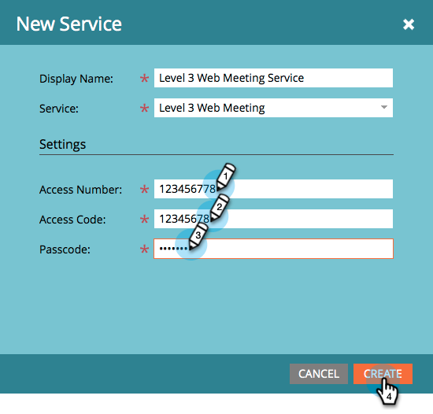

# [!DNL Level 3 Web Meeting]을(를) [!DNL LaunchPoint] 서비스로 추가 {#add-level-three-web-meeting-as-a-launchpoint-service}

Marketo에서 [!DNL Level 3 Web Meeting] 등록 및 출석을 관리합니다.

>[!NOTE]
>
>**관리자 권한 필요**

>[!NOTE]
>
>이 단계에는 [!DNL Level 3 Web Meeting]에 대한 기존 구독과 관리 권한이 필요합니다. 액세스 번호, 액세스 코드 및 암호를 바로 사용할 수 있습니다.

1. **[!UICONTROL Admin]** 영역으로 이동합니다.

   

1. **[!UICONTROL LaunchPoint]**&#x200B;를 클릭합니다.

   

1. **[!UICONTROL New]**&#x200B;을(를) 선택한 다음 **[!UICONTROL New Service]**&#x200B;을(를) 선택합니다.

   

1. **[!UICONTROL Display Name]** 입력. **[!UICONTROL Service]**&#x200B;에서 **[!UICONTROL Level 3 Web Meeting]**&#x200B;을(를) 선택합니다.

   

1. **[!UICONTROL Access Number]**, **[!UICONTROL Access Code]** 및 **[!UICONTROL Passcode]**&#x200B;을(를) 입력한 다음 **[!UICONTROL Create]**&#x200B;을(를) 클릭합니다.

   

[!DNL Level 3 Web Meeting] 계정이 이제 Marketo과 동기화되었습니다!

>[!MORELIKETHIS]
>
>[을(를) 사용하여  [!DNL Level 3 Web Meeting]](/help/marketo/product-docs/demand-generation/events/create-an-event/create-an-event-with-level-3-web-meeting.md){target="_blank"}이벤트를 만드는 방법에 대해 알아봅니다.
