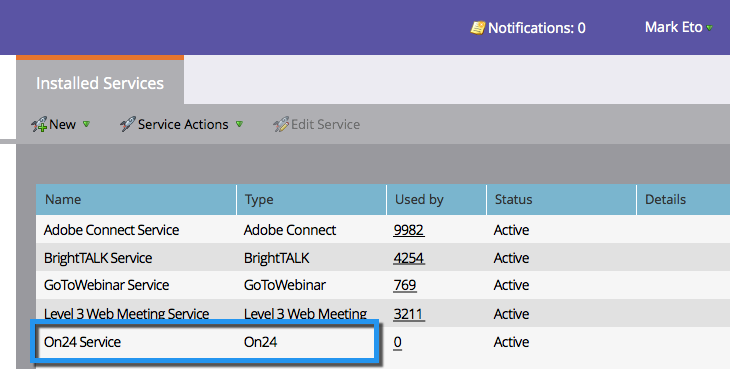

# ON24를 LaunchPoint 서비스로 추가 {#add-on-as-a-launchpoint-service}

ON24 웨비나 등록 및 참석을 관리하는 Marketing입니다.

>[!NOTE]
>
>**관리자 권한 필요**

>[!NOTE]
>
>이 단계에서는 ON24 및 관리 권한에 대한 기존 구독이 필요합니다. 다음 설정을 사용하십시오.클라이언트 키 및 클라이언트 ID. ON24 계정 관리자에서 바로 클라이언트 ID와 클라이언트 키를 얻을 수 있습니다.

1. 관리자로 **이동하고 LaunchPoint** 를 **클릭합니다**.

   

1. 새로 **만들기** , **새** ****&#x200B;서비스를 선택합니다.

   

1. 디스플레이 **이름을** **입력합니다**. 서비스 **에서** ON **24를 선택합니다**.

   

1. 클라이언트 **** 키 **및 클라이언트** ID를 **Settings** **** **** ****&#x200B;에 입력하고 ClickCreate를 클릭하여 프로세스를 완료합니다.

   

1. 이제 **ON24** 계정이 Marketing To와 동기화됩니다.

   

>[!MORELIKETHIS]
>
>ON24 [에서 웨비나 이벤트를 만드는 방법을 알아봅니다](../../../product-docs/demand-generation/events/create-an-event/create-an-event-with-the-marketo-on24-adapter/create-your-webinar-event-in-on24.md).

