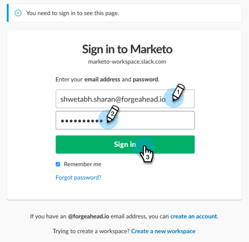

# Slack을 LaunchPoint 서비스로 추가 {#add-slack-as-a-launchpoint-service}

Slack 통합에는 두 가지 알림 유형이 포함되어 있습니다.

* **시스템 알림**:현재 캠페인 상태 및 즉각적인 주의가 필요한 모든 문제(CRM 오류 및 API 제한)에 대한 경고와 같이 Marketing to 인스턴스의 중요한 이벤트에 대한 Slack 알림을 받을 수 있습니다.
* **흥미로운 순간**:판매 계정에서 알려진 개인에 의해 Marketing To Insight가 트리거된 경우 리드 소유자에게 Slack을 통해 통지할 수 있습니다. 알림에는 판매 계정에 대한 세부 사항뿐만 아니라 리드 정보도 포함됩니다.

>[!NOTE]
>
>**관리자 권한 필요**

>[!PREREQUISITES]
>
>Slack 시스템 알림을 이미 사용할 수 없는 경우 [Marketing To 지원](https://nation.marketo.com/t5/Support/ct-p/Support)에 문의하십시오.

1. **LaunchPoint**&#x200B;로 이동한 다음 **새로 만들기** 아래에서 **새 서비스**&#x200B;를 클릭합니다.

   

1. Slack 통합의 표시 이름을 입력합니다. **서비스** 드롭다운에서 **Slack**&#x200B;을 선택합니다. **만들기**&#x200B;를 클릭합니다.

   

1. **승인**&#x200B;을 클릭합니다. 이렇게 하면 인증이 완료되고 Marketing To에게 Slack에서 정보를 가져올 수 있는 권한을 부여하는 새 탭의 Slack이 열립니다.

   

1. 새 Slack 탭에서 작업 영역의 URL을 입력하고 **계속**&#x200B;을 클릭합니다.

   

1. Slack 자격 증명을 입력하고 **로그인**&#x200B;을 클릭합니다.

   

1. **게시물 위치** 드롭다운에서 Marketing의 알림을 게시할 채널을 선택합니다. 요청된 권한을 검토한 다음 **승인**&#x200B;을 클릭합니다.

   

1. 아래 확인 화면이 표시됩니다. 탭이 자동으로 닫힙니다.

   

1. Marketing 탭을 새로 고치고 Slack이 이제 LaunchPoint에서 활성 서비스로 나열되는지 확인합니다.

   

   이제 6단계에서 선택한 채널에 알림이 게시됩니다. 그들은 다음과 같이 보일 것입니다.

   
