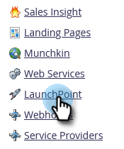

# [!DNL Webex]을(를) [!DNL LaunchPoint] 서비스로 추가 {#add-webex-as-a-launchpoint-service}

Marketo Engage에서 [!DNL Webex] 웨비나 등록 및 출석을 관리합니다. [[!UICONTROL Webex]](https://www.webex.com/)에 대한 기존 구독이 있어야 합니다.

>[!NOTE]
>
>**관리자 권한 필요**

1. **[!UICONTROL Admin]** 영역으로 이동합니다.

   

1. **[!UICONTROL LaunchPoint]**&#x200B;을(를) 클릭합니다.

   

1. **[!UICONTROL New]**&#x200B;을(를) 선택한 다음 **[!UICONTROL New Service]**&#x200B;을(를) 선택합니다.

   

1. **[!UICONTROL Display Name]** 입력. **[!UICONTROL Service]** 드롭다운에서 **[!UICONTROL Webex Webinars]**&#x200B;을(를) 선택합니다.

   

1. **[!UICONTROL Log Into Webex Webinars]**&#x200B;을(를) 클릭합니다.

   

1. Webex가 새 탭에서 열립니다. Webex 자격 증명을 사용하여 로그인합니다.

   

1. 로그인에 성공하면 탭이 닫히고 Marketo Engage의 _새 서비스_ 모달에는 &quot;Webex Webinars 계정이 설정되었습니다&quot;라고 표시됩니다. **[!UICONTROL Create]**&#x200B;을(를) 클릭합니다.

   

**[!DNL Webex]**&#x200B;이(가) 이제 Marketo과 동기화되었습니다.

>[!MORELIKETHIS]
>
>[이벤트를 만듭니다 [!DNL Webex]](/help/marketo/product-docs/demand-generation/events/create-an-event/create-an-event-with-webex.md){target="_blank"}.
