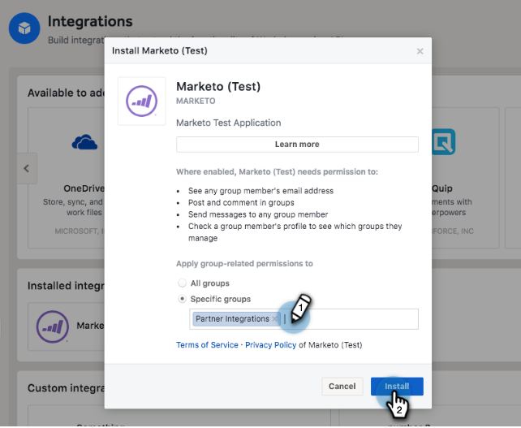
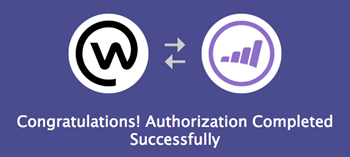
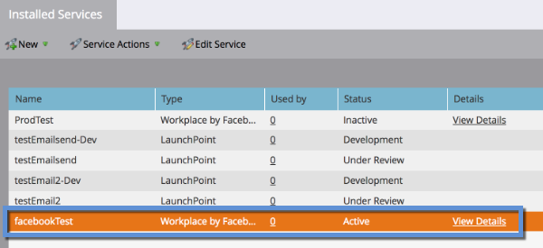

# facebook에서 LaunchPoint 서비스로 Workplace 추가 {#add-workplace-by-facebook-as-a-launchpoint-service}

Workplace 통합에 포함된 두 가지 알림 유형은 다음과 같습니다.

* **시스템 알림**: 현재 캠페인 상태에 대한 경고 및 즉각적인 주의가 필요한 문제(CRM 오류 및 API 제한)와 같이 Marketo 인스턴스의 중요한 이벤트에 대한 작업 공간 알림을 받습니다.
* **흥미로운 순간**: 알려진 개인이 판매 계정에서 Marketo Insight를 트리거하면 리드 소유자에게 Workplace를 통해 알릴 수 있습니다. 알림에는 판매 계정에 대한 세부 정보와 리드 정보가 포함됩니다.

>[!NOTE]
>
>**관리 권한 필요**

>[!PREREQUISITES]
>
>작업 공간 알림이 이미 활성화되어 있지 않은 경우 [Marketo 지원](https://nation.marketo.com/t5/Support/ct-p/Support){target=&quot;_blank&quot;}.

1. 로 이동합니다. **관리** 영역.

   

1. 클릭 **LaunchPoint**.

   

1. 선택 **새로 만들기** 그리고 **새 서비스**.

   

1. Workplace 통합에 사용할 표시 이름을 입력합니다. 에서 **서비스** 드롭다운에서 을 선택합니다. **Workplace by Facebook**. Click **Create**.

   

1. 시스템 알림과 흥미로운 순간을 수신하려면 옵션을 있는 그대로 둡니다. Click **Create**.

   

1. 클릭 **권한 부여**. 이렇게 하면 Workplace가 새 탭에 열립니다. 여기에서 인증을 완료하고 Workplace에서 정보를 가져올 수 있는 Marketo 권한을 부여합니다.

   

1. 새 Workplace 탭에서 비즈니스 이메일 또는 Workplace 사용자 이름을 입력하고 **계속**.

   

1. Workplace 자격 증명을 입력하고 **로그인**.

   

1. 작업 공간 팝업에서 Marketo의 알림을 게시하려는 Facebook 그룹(예: Partner Integration)을 선택합니다. 클릭 **설치**.

   

1. 아래에 확인 알림이 표시됩니다. 탭이 자동으로 닫힙니다.

   

1. Marketo 탭을 새로 고침하고 Workplace가 이제 LaunchPoint에서 활성 서비스로 나열되는지 확인합니다.

   

   이제 7단계에서 선택한 Facebook 그룹에 대한 알림 게시를 시작합니다. 그들은 다음과 같이 보일 것입니다.

   
