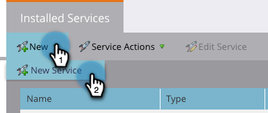

# LaunchPoint 서비스로 확대/축소 추가 {#add-zoom-as-a-launchpoint-service}

Marketing to에서 확대/축소 등록 및 참석을 관리합니다.

>[!NOTE]
>
>**관리자 권한 필요**

>[!NOTE]
>
>**미리 알림**
>
>이 단계에서는 확대/축소 및 관리 권한에 대한 기존 구독이 필요합니다. [확대/축소]에 로그인하는 데 사용하는 이메일 및 암호가 있어야 합니다.

1. 관리 **영역으로** 이동하고 LaunchPoint를 **클릭합니다**.

   

1. **신규 **드롭다운 을 클릭하고 **새 서비스를 선택합니다**.

   

1. `Enter a **Display Name**. Under **Service**, select`**확대/축소**.

   

1. 확대/축소 **로그인을 클릭합니다**.

   

1. 확대/축소 로그인 창에서 확대/축소 자격 증명을 입력하고 **로그인을 클릭합니다**.

   

1. 창을 닫은 후 **만들기를 클릭합니다**.

   

   좋아요! 이제 확대/축소 계정이 Marketing To와 동기화되고 LaunchPoint 영역에서 찾을 수 있습니다.

>[!CAUTION]
>
>확대/축소에서 암호를 업데이트할 때는 Marketing Cloud에서도 암호를 업데이트해야 합니다.

>[!MORELIKETHIS]
>
>확대/축소 [를 사용하여 이벤트를 만드는 방법을 알아봅니다](../../../product-docs/demand-generation/events/create-an-event/create-an-event-with-zoom.md).

