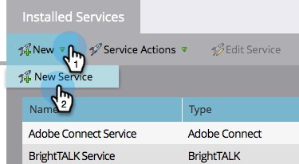

# LaunchPoint 서비스로 확대/축소 추가 {#add-zoom-as-a-launchpoint-service}

Marketo에서 확대/축소 등록 및 참석 여부를 관리합니다.

>[!NOTE]
>
>**관리 권한 필요**

>[!NOTE]
>
>이 단계에서는 확대/축소 및 관리 권한에 대한 기존 구독이 필요합니다. [확대/축소]에 로그인하는 데 사용할 이메일과 암호가 있습니다.

1. 로 이동합니다. **관리** 영역.

   

1. 클릭 **LaunchPoint**.

   

1. 선택 **새로 만들기** 그리고 **새 서비스**.

   

1. 을(를) 입력합니다. **표시 이름**. 아래 **서비스**, 선택 **확대/축소**.

   

1. 클릭 **확대/축소에 로그인**.

   

1. 확대/축소 로그인 창에서 확대/축소 자격 증명을 입력하고 **로그인**.

   

1. 창을 닫은 후 **만들기**.

   

   좋아요! 이제 확대/축소 계정이 Marketo과 동기화되며 LaunchPoint 영역에서 찾을 수 있습니다.

>[!CAUTION]
>
>확대/축소에서 암호를 업데이트할 때는 Marketo에서도 암호를 업데이트해야 합니다.

>[!MORELIKETHIS]
>
>방법 알아보기 [확대/축소를 사용하여 이벤트 만들기](/help/marketo/product-docs/demand-generation/events/create-an-event/create-an-event-with-zoom.md).
