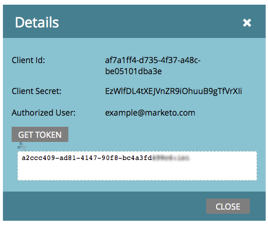

# ReST API와 함께 사용할 사용자 정의 서비스 만들기 {#create-a-custom-service-for-use-with-rest-api}

ReST API를 통해 Marketo과 통합하려면 사용자 지정 서비스를 만들어야 합니다. 방법은 다음과 같습니다.

>[!PREREQUISITES]
>
>* [API 전용 사용자 역할 만들기](/help/marketo/product-docs/administration/users-and-roles/create-an-api-only-user-role.md)
>* [API 전용 사용자 만들기](/help/marketo/product-docs/administration/users-and-roles/create-an-api-only-user.md)
>

>[!NOTE]
>
>**관리자 권한 필요**

>[!TIP]
>
>에 대한 자세한 내용은 개발자 설명서를 참조하십시오. [나머지 API](https://developer.adobe.com/marketo-apis/). 다음 항목도 있습니다. [SOAP API](https://experienceleague.adobe.com/en/docs/marketo-developer/marketo/soap/soap-api) 그게 당신이 필요한 거라면

## 사용자 정의 서비스 만들기 {#create-custom-service}

1. 로 이동 **[!UICONTROL 관리자]** 영역입니다.

   

1. 클릭 **시작 지점**.

   

1. 선택 **[!UICONTROL 신규]** 그런 다음 **[!UICONTROL 새 서비스]**.

   

1. 입력 **[!UICONTROL 표시 이름]** 서비스를 위해. 다음 항목 선택 **[!UICONTROL API 전용 사용자]** [이전에 생성됨](/help/marketo/product-docs/administration/users-and-roles/create-an-api-only-user.md).

   

   >[!NOTE]
   >
   >인기 웨비나 서비스에 대한 기본 통합이 이미 있습니다.

1. 클릭 **[!UICONTROL 만들기]**.

   

   오, 그래! 이제 서비스가 생성되었습니다. 계속 진행하여 액세스를 위해 제공할 모든 자격 증명을 가져오겠습니다.

## API 액세스용 자격 증명 {#credentials-for-api-access}

1. 로 이동 **[!UICONTROL 관리자]** 영역입니다.

   

1. 클릭 **[!UICONTROL 시작 지점]**.

   

1. 클릭 **[!UICONTROL 세부 사항 보기]** 사용자 정의 [!UICONTROL 시작 지점] 위에서 서비스를 만들었습니다.

   

1. 클릭 **[!UICONTROL 토큰 가져오기]**.

   

1. 다음을 제공합니다 **[!UICONTROL 클라이언트 ID]**, **[!UICONTROL 클라이언트 암호]**, **[!UICONTROL 승인된 사용자]**, 및 **[!UICONTROL 토큰]** 연결을 설정하는 담당자에게 문의하십시오.

   

>[!CAUTION]
>
>이 정보를 공유하지 마십시오. 데이터는 뒷문입니다. 안전하게 보관해!
