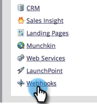

# 만들기 [!DNL Webhook] {#create-a-webhook}

사용 [!DNL Webhooks] 서드파티 웹 서비스를 사용하여 텍스트 메시지를 보내고 개인 데이터를 확장하는 등의 작업을 수행합니다.

>[!AVAILABILITY]
>
>일부 Marketo Engage 사용자가 이 기능을 구입한 것은 아닙니다. 자세한 내용은 Adobe 계정 팀(계정 관리자)에 문의하십시오.

1. 로 이동 **[!UICONTROL 관리자]** 영역입니다.

   

1. 클릭 **[!UICONTROL 웹훅]**.

   

1. 클릭 **[!UICONTROL 새 Webhook]**.

   

1. 이름 지정 및 구성 [!DNL Webhook].

   

   >[!NOTE]
   >
   >여기에는 종종 타사 서비스 자격 증명을 URL 매개 변수로 입력하거나 POST 템플릿에 입력하는 작업이 포함됩니다.

   * **[!UICONTROL URL]**: 웹 서비스에 대한 요청에 사용하는 URL을 입력합니다. 개인 이메일 주소( )와 같은 토큰을 삽입하려면&#x200B;**`{{lead.Email Address}}`**), 요청에서 **[!UICONTROL 토큰 삽입]**.

   * **[!UICONTROL 템플릿]**: 요청 본문에서 정보를 전송하려면 페이로드 템플릿을 통해 을 입력합니다. POST, DELETE, PATCH 또는 PUT 요청 유형에 대해 허용되는 템플릿. JSON 또는 XML과 같은 데이터 형식을 사용할 수 있습니다. 템플릿에 토큰을 삽입하려면 **[!UICONTROL 토큰 삽입]**.

   * **[!UICONTROL 토큰 인코딩 요청]**: 토큰 값에 특수 문자(예: 앰퍼샌드, &#39;&amp;&#39;)가 포함된 경우, 요청 형식을 지정하십시오(**JSON** 또는 **양식/Url**).

   * **[!UICONTROL 응답 유형]**: 서비스에서 받는 응답의 형식을 선택합니다(**JSON** 또는 **XML**).

   * **[!UICONTROL 요청 유형]**: 사용할 HTTP 메서드(DELETE, GET, PATCH, POST, PUT)를 선택합니다.

1. Click **[!UICONTROL Create]**.

   

>[!NOTE]
>
>다음에서 자세히 알아보기 [[!DNL Webhooks]](https://developers.marketo.com/documentation/webhooks/){target="_blank"} 깊이 잠수해.
