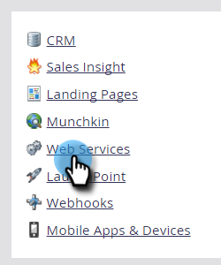

# IP 기반 API 액세스에 대한 허용 목록 만들기 {#create-an-allowlist-for-ip-based-api-access}

경우에 따라 특정 IP 주소 또는 주소 범위에만 API 액세스 권한을 제공하려고 합니다. 이렇게 하려면 먼저 제한을 활성화한 다음 API 사용이 허용되는 IP 주소를 지정합니다.

>[!NOTE]
>
>**관리자 권한 필요**

>[!NOTE]
>
>이 기능은 Marketo Engage의 [IP 기반 액세스 제어](https://experienceleague.adobe.com/ko/docs/marketo/using/product-docs/administration/settings/restrict-marketo-logins-based-on-ip){target="_blank"}로 대체되는 Admin Console [IP 기반 로그인 제한](https://helpx.adobe.com/enterprise/using/ip-based-access.html){target="_blank"}과 별도로 작동합니다. Adobe IMS 마이그레이션 후에도 그대로 작동합니다.

1. **[!UICONTROL Admin]** 영역으로 이동합니다.

   

1. **[!UICONTROL Web Services]**&#x200B;를 클릭합니다.

   

1. **[!UICONTROL IP Restrictions]** 영역에서 **[!UICONTROL Edit],**&#x200B;을(를) 클릭하거나 왼쪽 상단의 **[!UICONTROL Edit IP Restrictions]**&#x200B;을(를) 클릭합니다.

   

1. **[!UICONTROL Enable IP Restrictions]** 상자를 선택하고 허용 목록에 사용할 IP 주소를 입력하십시오.

   

   >[!NOTE]
   >
   >단일 IP 주소 또는 주소 범위를 입력하거나 와일드카드를 사용할 수 있습니다.

1. 추가 필드를 열어 추가 IP 주소를 입력하려면 **[!UICONTROL Add]**&#x200B;을(를) 클릭하십시오.

   

1. **[!UICONTROL Save]**&#x200B;를 클릭합니다.

   
