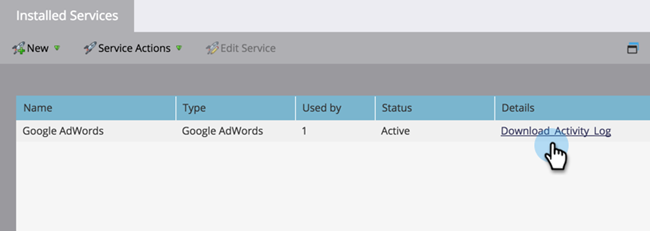

# [!DNL Google Adwords] 활동 로그 다운로드 {#download-googleadwords-activity-log}

일이 일어나죠. 문제를 해결하려면 활동 로그를 다운로드해야 하는 경우가 있습니다.

1. **[!UICONTROL 관리자]** 영역으로 이동합니다.

   

1. **[!UICONTROL LaunchPoint]**&#x200B;을 클릭합니다.

   

1. [!DNL Google AdWords] 서비스를 찾은 다음 **[!UICONTROL 활동 로그 다운로드]**&#x200B;를 클릭합니다.

   

1. .zip 파일이 컴퓨터에 다운로드됩니다.
