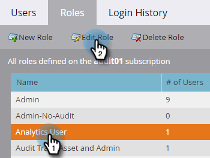

# 감사 추적 활성화 {#enable-audit-trail}

감사 추적은 모든 고객이 사용할 수 있으며 두 가지 관리자 권한으로 제어합니다.

>[!NOTE]
>
>기본적으로 모든 시스템 관리자 역할에는 두 권한이 모두 활성화되어 있습니다.

## 역할에 대한 감사 추적 활성화 {#enable-audit-trail-for-a-role}

1. **[!UICONTROL Admin]**&#x200B;를 클릭합니다.

   

1. **[!UICONTROL Users & Roles]**&#x200B;으로 선택하고 **[!UICONTROL Roles]**&#x200B;를 클릭합니다.

   

1. 감사 추적을 활성화할 역할을 선택하고 **[!UICONTROL Edit Role]**&#x200B;을(를) 클릭합니다.

   

   >[!NOTE]
   >
   >또한 여기에 새 역할을 만들고 감사 추적 액세스 권한을 부여할 수 있는 옵션이 있습니다.

1. **[!UICONTROL Access Admin]** 권한을 확장합니다. 필요에 따라 **[!UICONTROL Access Audit Trail]** 및/또는 **[!UICONTROL Access Login History]**&#x200B;을(를) 선택하십시오. **[!UICONTROL Save]**&#x200B;를 클릭합니다.

   

   >[!NOTE]
   >
   >**정의**
   >
   >**[!UICONTROL Access Audit Trail]**: 사용자에게 [!UICONTROL Asset Audit Trail]과(와) [!UICONTROL Admin Audit Trail]에 모두 액세스할 수 있는 권한을 제공합니다.
   >
   >**[!UICONTROL Access Login History]**: 사용자에게 [사용자 로그인 기록](/help/marketo/product-docs/administration/audit-trail/user-login-history.md)에 대한 액세스 권한을 부여합니다.

## 사용자에게 감사 추적 역할 할당 {#assign-audit-trail-role-to-a-user}

>[!PREREQUISITES]
>
>기존 역할을 [만들기](/help/marketo/product-docs/administration/users-and-roles/create-delete-edit-and-change-a-user-role.md#create-a-role) 또는 [활성화](#enable-audit-trail)하여 감사 추적 권한을 부여합니다.

1. **[!UICONTROL Users & Roles]**&#x200B;에서 **[!UICONTROL Users]**&#x200B;을(를) 클릭합니다.

   

1. 감사 추적 액세스 권한을 부여할 사용자를 선택하고 **[!UICONTROL Edit User]**&#x200B;을(를) 클릭합니다.

   

   >[!NOTE]
   >
   >이 프로세스는 새 사용자를 만들 때도 적용됩니다.

1. 생성한 감사 추적 역할을 선택합니다. 이 예제에서는 &quot;Audit Trail - Asset and Admin&quot;과 &quot;Audit Trail - With Login History&quot;를 만들었습니다.

   

   >[!CAUTION]
   >
   >작업 영역이 활성화되어 있으면 모든 작업 영역을 선택하는 역할의 확인란을 선택해야 합니다. 개별 작업 영역을 선택 해제하면 감사 추적이 숨겨집니다. 즉, 모든 작업 공간에 대한 감사 추적 데이터를 보게 됩니다. [필터링](/help/marketo/product-docs/administration/audit-trail/filtering-in-audit-trail.md)할 때 작업 영역을 숨길 수 있습니다.

1. **[!UICONTROL Save]**&#x200B;를 클릭합니다.

   
