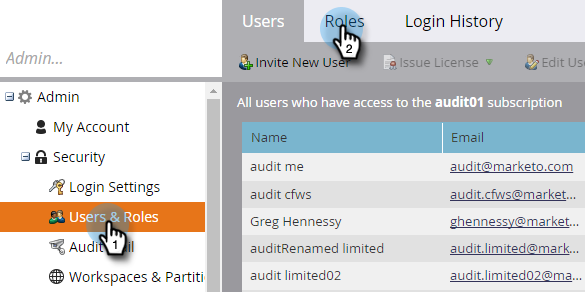

# 감사 추적 활성화 {#enable-audit-trail}

감사 추적은 모든 고객이 사용할 수 있으며 두 명의 관리자 권한으로 제어할 수 있습니다.

>[!NOTE]
>
>기본적으로 모든 시스템 관리자 역할에는 두 권한이 모두 활성화되어 있습니다.

## 역할에 대한 감사 추적 활성화 {#enable-audit-trail-for-a-role}

1. 클릭 **관리**.

   

1. 선택 **사용자 및 역할** 을(를) 클릭합니다. **역할**.

   

1. 감사 추적을 활성화할 역할을 선택하고 을 클릭합니다 **역할 편집**.

   

   >[!NOTE]
   >
   >새 역할을 만들고 감사 추적 액세스 권한을 부여할 수도 있습니다.

1. 를 확장합니다. **관리자 액세스** 권한. 선택 **액세스 감사 추적** 및/또는 **로그인 기록 액세스**&#x200B;에 적용되는 제한이 없습니다. 클릭 **저장**.

   

   >[!NOTE]
   >
   >**정의**
   >
   >**액세스 감사 추적:** 사용자에게 자산 감사 추적 및 관리자 감사 추적에 모두 액세스할 수 있는 권한을 제공합니다.
   >
   >**로그인 기록 액세스:** 사용자에게 [사용자 로그인 내역](/help/marketo/product-docs/administration/audit-trail/user-login-history.md).

## 사용자에게 감사 추적 역할 할당 {#assign-audit-trail-role-to-a-user}

>[!PREREQUISITES]
>
>[만들기](/help/marketo/product-docs/administration/users-and-roles/create-delete-edit-and-change-a-user-role.md#create-a-role) 또는 [활성화](#enable-audit-trail) 감사 추적 권한을 부여하는 기존 역할.

1. in **사용자 및 역할**&#x200B;를 클릭합니다. **사용자**.

   

1. 감사 추적 액세스 권한을 부여할 사용자를 선택하고 을(를) 클릭합니다 **사용자 편집**.

   

   >[!NOTE]
   >
   >이 프로세스는 새 사용자를 만들 때도 적용됩니다.

1. 만든 감사 추적 역할을 선택합니다. 이 예에서는 &quot;감사 추적 - 자산 및 관리&quot; 및 &quot;감사 추적 - 로그인 내역 사용&quot;을 만들었습니다.

   

   >[!CAUTION]
   >
   >작업 공간이 활성화된 경우 모든 작업 공간을 선택하는 역할의 확인란을 선택해야 합니다. 개별 작업 공간을 선택 해제하면 감사 추적이 숨겨집니다. 즉, 모든 작업 공간에 대한 감사 추적 데이터가 표시됩니다. 다음과 같은 경우 작업 공간을 숨길 수 있습니다 [필터링](/help/marketo/product-docs/administration/audit-trail/filtering-in-audit-trail.md).

1. 클릭 **저장**.

   
