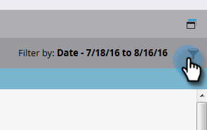
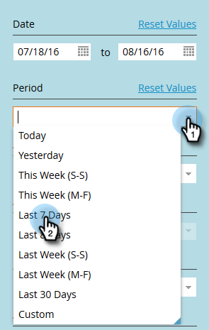

# 감사 추적 필터링 {#filtering-in-audit-trail}

시간대, 에셋 유형, 사용자, 수행한 작업 등을 기준으로 필터링합니다.

1. **[!UICONTROL Admin]**&#x200B;를 클릭합니다.

   

1. **[!UICONTROL Security]**&#x200B;에서 **[!UICONTROL Audit Trail]**&#x200B;을(를) 선택합니다.

   

1. 필터 아이콘을 클릭합니다.

   

   >[!NOTE]
   >
   >많은 가능한 검색 매개변수 조합이 있습니다. 이 예제에서는 _이전 7일 동안의 모든 전자 메일(모든 사람이 편집한 메일)을 찾습니다_.

1. **[!UICONTROL Period]** 드롭다운을 클릭하고 **[!UICONTROL Last 7 Days]**&#x200B;를 선택합니다.

   

1. **[!UICONTROL Asset Type]** 드롭다운을 클릭하고 **[!UICONTROL Email]**&#x200B;를 선택합니다.

   

1. **작업 드롭다운을 클릭하고**&#x200B;을(를) 선택합니다.**[!UICONTROL Edit]**

   

1. **[!UICONTROL Apply]**&#x200B;를 클릭합니다.

   

1. 필터링된 결과가 왼쪽에 나타납니다.

   

   다 됐습니다!

   >[!NOTE]
   >
   >작업 영역이 활성화되어 있으면 모든 작업 영역에 대한 감사 데이터가 표시됩니다. 작업 영역 필터를 적용하면 Marketo은 감사 추적을 사용할 때마다 이전 작업 영역 값을 기억합니다. 에셋 수준의 Workspace 권한이 강제 적용됩니다.

   >[!MORELIKETHIS]
   >
   >[감사 추적에서 세부 정보 변경](/help/marketo/product-docs/administration/audit-trail/change-details-in-audit-trail.md)
