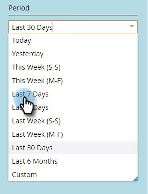

# 사용자 로그인 내역 {#user-login-history}

사용자 로그인 기록은 로그인 시도 실패 등 구독에 로그인한 사용자를 정확하게 표시함으로써 책임과 보안을 유지하는 데 도움이 됩니다.

>[!PREREQUISITES]
>
>사용자 로그인 기록을 보려면 로그인 기록 액세스 권한이 활성화된 역할이 있어야 합니다.

사용자 로그인 내역은 다음 방법으로 로그인하는 사용자를 식별합니다.

* 로그인 시간 및 날짜
* 사용자 이름 및 이메일 주소
* 역할
* 작업 영역
* IP 주소

사용자 로그인 기록을 보려면 다음 작업을 수행하십시오.

1. **[!UICONTROL 관리자]** 영역으로 이동합니다.

   

1. 보안에서 **[!UICONTROL 사용자 및 역할]**&#x200B;을 클릭합니다.

   

1. **[!UICONTROL 로그인 기록]** 탭을 클릭합니다. 목록에는 가장 최근 로그인이 표시됩니다.

   

1. 필터를 사용하여 검색 범위를 좁힙니다.

   

1. 날짜 선택기를 사용하여 날짜 범위를 선택합니다.

   

1. 또는 드롭다운에서 을 선택합니다.

   

1. **[!UICONTROL 사용자]** 드롭다운에서 사용자를 선택하십시오.

   

1. **[!UICONTROL 실패한 로그인만]** 상자를 선택하여 실패한 로그인만 검색에 표시합니다.

   

1. **[!UICONTROL 적용]**&#x200B;을 클릭합니다.

   

   >[!NOTE]
   >
   >사용자 인터페이스는 최대 30일의 데이터를 표시합니다. 더 필요한 경우 최근 6개월 동안의 데이터를 csv 파일로 다운로드할 수 있습니다.

   >[!MORELIKETHIS]
   >
   >[감사 추적 개요](/help/marketo/product-docs/administration/audit-trail/audit-trail-overview.md)
