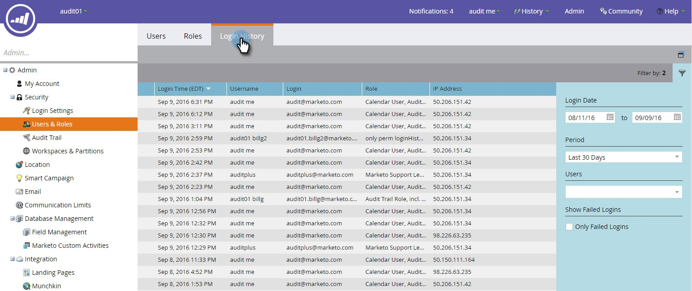

# 사용자 로그인 내역 {#user-login-history}

사용자 로그인 내역은 실패한 로그인 시도를 포함하여 사용료 지불 옵션에 로그인된 사용자를 정확하게 표시하여 책임과 보안을 유지하는 데 도움이 됩니다.

>[!PREREQUISITES]
>
>사용자 로그인 내역을 보려면 액세스 로그인 내역 권한이 활성화된 역할이 있어야 합니다.

사용자 로그인 내역은 다음 방법으로 로그인한 사람을 식별합니다.

* 로그인 시간 및 날짜
* 사용자 이름 및 이메일 주소
* 역할
* 작업 영역
* IP 주소

사용자 로그인 내역을 보려면:

1. **관리** 탭을 클릭하고 보안 아래에서 **사용자 및 역할**&#x200B;을 클릭합니다.

   

1. **로그인 내역** 탭을 클릭합니다. 이 목록에는 최근 로그인 정보가 표시됩니다.

   

1. 필터를 사용하여 검색 범위를 좁힙니다.

   

1. 날짜 선택기를 사용하여 날짜 범위를 선택합니다.

   

1. 또는 드롭다운에서 선택합니다.

   

1. **사용자** 드롭다운에서 사용자를 선택합니다.** **

   ** 

   **

1. 검색에 실패한 로그인만 표시하려면 **실패한 로그인만** 상자를 선택합니다.

   

1. **적용**&#x200B;을 클릭합니다.

   

   >[!NOTE]
   >
   >사용자 인터페이스는 최대 30일 동안의 데이터를 표시합니다. 더 필요한 경우 최근 6개월 동안의 데이터를 csv 파일로 다운로드할 수 있습니다.

   >[!NOTE]
   >
   >**관련 문서**
   >
   >    
   >    
   >    * [감사 추적 개요](audit-trail-overview.md)

