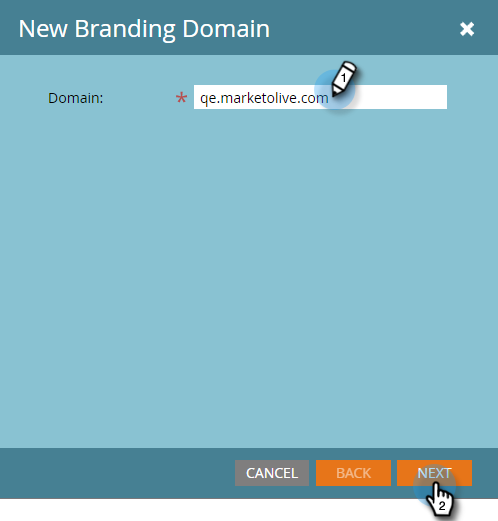

# 작업 영역을 사용하여 추가 브랜딩 도메인 추가 {#add-an-additional-branding-domain-with-workspaces}

작업 영역이 있는 경우 브랜딩 도메인을 추가할 수 있습니다.

>[!PREREQUISITES]
>
>먼저 [기본 브랜딩 도메인을 편집](/help/marketo/product-docs/administration/email-setup/add-multiple-branding-domains/edit-your-default-branding-domain.md)해야 합니다.
>
>추가 브랜딩 도메인을 추가하기 전에 먼저 [일반 추적 링크를 브랜딩 도메인으로 바꾸기](/help/marketo/product-docs/administration/email-setup/add-multiple-branding-domains/edit-your-default-branding-domain-with-workspaces.md)해야 합니다.

1. **[!UICONTROL 관리자]** 영역으로 이동합니다.

   

1. **[!UICONTROL 전자 메일]**&#x200B;을 클릭하세요.

   

1. 추가 브랜딩 도메인을 추가하려면 **[!UICONTROL 추가]**&#x200B;를 클릭하십시오.

   

1. 새 브랜딩 도메인을 입력합니다. **[!UICONTROL 다음]**&#x200B;을 클릭합니다.

   

   >[!NOTE]
   >
   >하나 이상의 작업 영역에 대해 이 도메인을 주 도메인으로 설정할 수 있으며, 기존의 모든 전송되지 않은 이메일이 &quot;기본&quot;으로 설정되고 새로 생성된 모든 이메일은 기본적으로 주 도메인으로 설정됩니다. 이메일별로 이를 재정의할 수 있습니다.

1. 새 브랜딩 도메인을 선택하고 **[!UICONTROL 저장]**&#x200B;을 클릭합니다.

   
