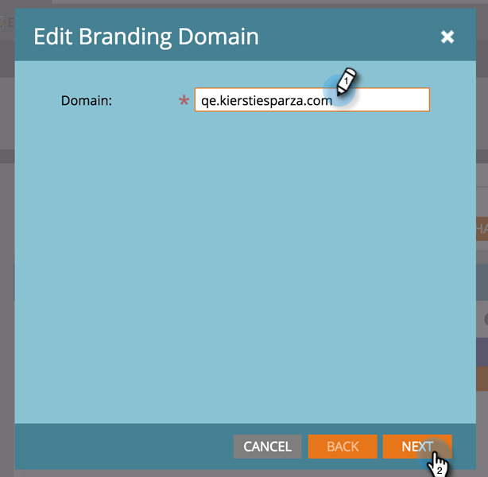
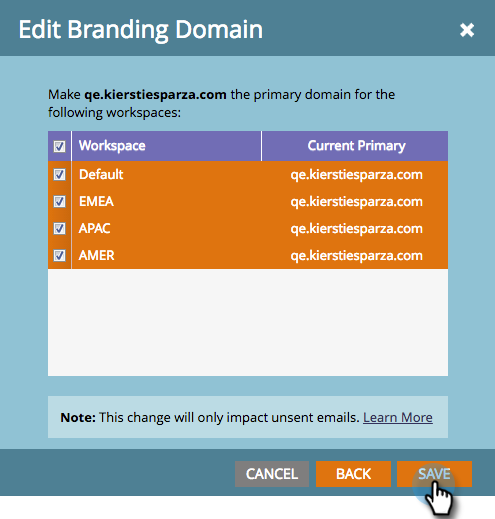

# 작업 영역을 사용하여 기본 브랜딩 도메인 편집 {#edit-your-default-branding-domain-with-workspaces}

1. **[!UICONTROL Admin]** 영역으로 이동합니다.

   

1. **[!UICONTROL Email]**&#x200B;를 클릭합니다.

   

1. [!UICONTROL Branding Domains] 테이블에서 현재 일반 도메인을 선택하고 **[!UICONTROL Edit]**&#x200B;을(를) 클릭하여 회사의 브랜드 도메인으로 변경합니다.

   

   >[!NOTE]
   >
   >일반 도메인을 편집해야 **[!UICONTROL Add]**&#x200B;이(가) 작동합니다. **[!UICONTROL Delete]**&#x200B;은(는) 두 번째 도메인을 추가할 때까지 작동하지 않습니다.

1. 기본 도메인 이름을 입력하고 **[!UICONTROL Next]**&#x200B;을(를) 클릭합니다.

   

1. **[!UICONTROL Save]**&#x200B;를 클릭합니다.

   

>[!NOTE]
>
>추가 브랜딩 도메인을 추가할 때 이 도메인을 하나 이상의 작업 공간에 대한 주 도메인으로 설정할 수 있으며, &quot;기본값&quot;으로 설정되어 있고 새로 만든 모든 이메일이 기본 도메인으로 설정됩니다. 이메일별로 이를 재정의할 수 있습니다.

이제 작업 영역에 필요한 [추가 브랜딩 도메인을 추가](/help/marketo/product-docs/administration/email-setup/add-multiple-branding-domains/add-an-additional-branding-domain-with-workspaces.md)할 수 있습니다.
