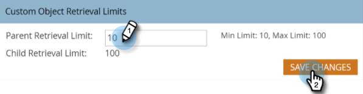

# 속도 스크립팅의 사용자 지정 개체 검색 제한 변경 {#change-custom-object-retrieval-limits-in-velocity-scripting}

Velocity Script를 사용하여 이메일에 사용자 지정 개체 데이터를 표시할 경우 이 기능을 사용할 수 있습니다. 기본적으로 Velocity Script에서 10개의 상위 사용자 정의 개체에 액세스할 수 있습니다. 더 많은 액세스가 필요한 경우 계속 읽으십시오.

## 속도 {#what-is-velocity}란 무엇입니까?

[Apache](https://velocity.apache.org/) Velocity는 HTML 컨텐츠를 템플릿 작성 및 스크립팅하기 위해 설계된 Java 기반의 언어입니다. Marketo에서는 [스크립팅 토큰](/help/marketo/product-docs/email-marketing/general/using-tokens/create-an-email-script-token.md)을 사용하여 이메일 컨텍스트에서 사용할 수 있습니다. 무엇보다도 사용자 정의 개체에 저장된 데이터에 액세스할 수 있습니다.

리드 또는 연락처에 직접 연결되어 있지만 3차 사용자 지정 개체는 참조할 수 없습니다. 각 사용자 정의 개체에 대해 1인/접촉자당 가장 최근에 업데이트된 레코드 10개를 런타임에 사용할 수 있으며 가장 최근에 업데이트된 레코드(0)부터 가장 오래된 업데이트(9)까지 순서가 지정됩니다.

## 제한 {#how-to-change-the-limit}을 변경하는 방법

1. **관리** 섹션으로 이동합니다.

   

1. **이메일**&#x200B;을 클릭합니다.

   

1. 사용자 지정 개체 검색 제한 테이블에 새 상위 검색 제한을 입력하고 **변경 내용 저장**&#x200B;을 클릭합니다.

   

>[!NOTE]
>
>상위 검색 한도 값은 10 - 100 사이여야 합니다. 하위 검색 제한은 자동으로 설정됩니다. 1000을 상위 검색 한계로 나눈 것입니다. 예를 들어 상위 제한을 50으로 설정하면 하위 제한이 20이 됩니다(1000 ÷ 50 = 20).

달콤해! 이제 Velocity 스크립트에서 더 많은 사용자 정의 객체에 액세스할 수 있습니다.
