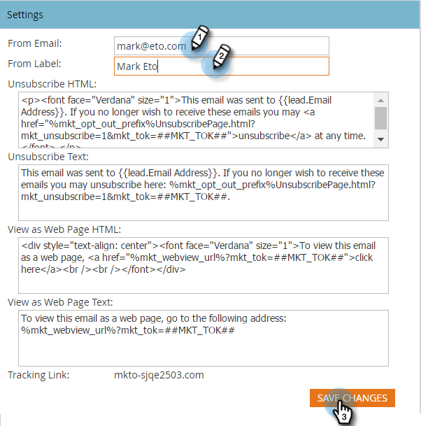

# 기본 보낸 사람 이메일 및 보낸 사람 레이블 변경 {#change-the-default-from-email-and-from-label}

각 관리자는 **[!UICONTROL From Email]** 및 **[!UICONTROL From Label]**&#x200B;의 기본값을 변경하여 새 전자 메일을 만들 때 해당 기본값이 사용되도록 할 수 있습니다.

>[!NOTE]
>
>**관리자 권한 필요**

1. **[!UICONTROL Admin]** 섹션으로 이동합니다.

   

1. **[!UICONTROL Email]**&#x200B;를 클릭합니다.

   

1. **[!UICONTROL From Email]** 및 **[!UICONTROL From Label]**&#x200B;에 대해 원하는 기본값을 입력한 다음 **[!UICONTROL Save Changes]**&#x200B;을(를) 클릭합니다.

   

>[!NOTE]
>
>변경 사항은 귀하에게만 적용되며 다른 Marketo 사용자에게는 적용되지 않습니다.

이제 새 이메일을 만들 때마다 사용자가 설정한 기본값이 사용됩니다.
