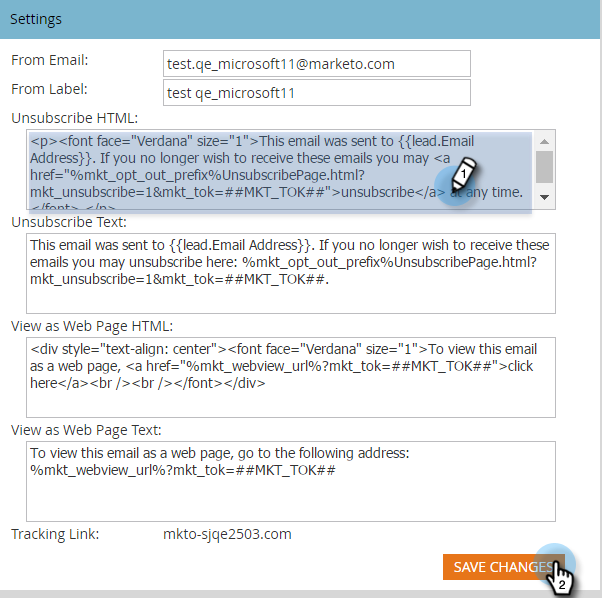

# 구독 취소 메시지 편집 {#edit-the-unsubscribe-message}

>[!NOTE]
>
>**관리자 권한 필요**

마케팅 이메일([operational](/help/marketo/product-docs/email-marketing/general/functions-in-the-editor/make-an-email-operational.md) 이외)을 보낼 때 구독 취소 텍스트와 링크가 맨 아래에 추가됩니다. 기본값을 변경할 수 있습니다.

## 편집할 위치 {#where-to-make-the-edit}

1. **[!UICONTROL Admin]** 섹션으로 이동합니다.

   

1. **[!UICONTROL Email]**&#x200B;를 클릭합니다.

   

   >[!CAUTION]
   >
   >다음 변수는 중요합니다. 삭제하지 마십시오!
   >
   >* `%mkt_opt_out_prefix%`
   >* `mkt_unsubscribe=1&mkt_tok=##MKT_TOK##`

1. **[!UICONTROL Unsubscribe HTML]** 및 **[!UICONTROL Unsubscribe Text]** 버전을 원하는 대로 편집하고 **[!UICONTROL Save Changes]**&#x200B;을(를) 클릭합니다.

   

>[!TIP]
>
>* 테스트하는 것을 잊지 마십시오. 마케팅 이메일에 구독 취소 링크가 끊어지지 않도록 해야 합니다.
>
>* [토큰](/help/marketo/product-docs/email-marketing/general/using-tokens/add-a-system-token-as-a-link-in-an-email.md)을 사용하여 전자 메일에서 구독 취소 HTML의 위치를 사용자 지정할 수 있습니다.

## 기본 구독 취소 텍스트 {#default-unsubscribe-text}

기본 시스템 구독 취소 메시지로 되돌리려면 다음을 복사/붙여넣습니다.

[!UICONTROL Unsubscribe HTML]:
`
If you no longer wish to receive these emails, click on the following link: <a href="%mkt_opt_out_prefix%UnsubscribePage.html?mkt_unsubscribe=1&mkt_tok=##MKT_TOK##">Unsubscribe</a> 
`
 
[!UICONTROL Unsubscribe Text]:
`%mkt_opt_out_prefix%UnsubscribePage.html?mkt_unsubscribe=1&mkt_tok=##MKT_TOK##`

>[!MORELIKETHIS]
>
>[웹 페이지로 보기 메시지 편집](/help/marketo/product-docs/administration/email-setup/edit-the-view-as-web-page-message.md)
