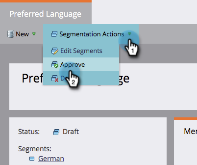
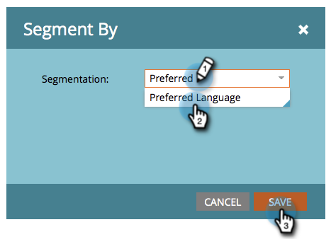

# 구독 취소 메시지를 동적으로 언어 {#make-your-unsubscribe-message-dynamic-for-languages}

기본 구독 취소 메시지와 링크는 영어로 제공됩니다. 동적 컨텐츠를 사용하여 다른 언어로 표시할 수 있습니다.

>[!NOTE]
>
>아래 튜토리얼을 통해 유용한 정보를 제공합니다. 이것은 좋은 것을 상징하지만, 이것은 다른 방법으로 이루어질 수 있다.

1. 데이터 준비
1. [&quot;기본 ](../../../../product-docs/administration/field-management/create-a-custom-field-in-marketo.md)설정 언어&quot;라는 사용자 정의 필드를 만듭니다. 이 필드를 동기화하려면 CRM에서 설정합니다.

   >[!TIP]
   >
   >나중에 [양식](../../../../product-docs/demand-generation/forms/creating-a-form/create-a-form.md)을 만들 때 이 필드를 사용하여 언어 기본 설정을 캡처하십시오.

1. 세그멘테이션 만들기
1. **데이터베이스**로 이동합니다.
** 

   **

1. **새로 만들기** 드롭다운에서 **새 세그멘테이션**&#x200B;을 클릭합니다.

   

1. 세그먼트 이름 **기본 언어**. **세그먼트 추가**&#x200B;를 클릭합니다. 언어를 입력합니다.

   

   >[!NOTE]
   >
   >기본 세그먼트는 영어입니다.

1. 모든 언어가 표시될 때까지 세그먼트를 계속 추가합니다. **만들기**&#x200B;를 클릭합니다.

   

1. 세그먼트를 선택합니다.

   

1. **스마트 목록** 탭으로 이동합니다. 검색 필드에 **기본 언어**&#x200B;를 입력합니다. 필터를 캔버스로 드래그하여 놓습니다.

   

1. 해당 언어를 설정합니다.

   

1. 모든 다른 언어에 대해 반복합니다. 그런 다음 **세그멘테이션 작업** 드롭다운을 선택하고 **승인**&#x200B;을 클릭합니다.

   

1. 코드 단편 만들기
1. **디자인 스튜디오**&#x200B;로 이동합니다.

   

1. **새로 만들기** 드롭다운에서 **새 조각**&#x200B;을 클릭합니다.

   ** 

   **

1. 코드 단편 이름을 **구독 취소 메시지**&#x200B;로 지정합니다. **만들기**&#x200B;를 클릭합니다.

   

1. 기본 구독 취소 메시지를 입력하고 강조 표시한 다음 하이퍼링크 아이콘을 클릭합니다.

   

1. 이 토큰을 복사하여 붙여 넣습니다.**`{{system.unsubscribeLink}}`**&#x200B;링크 URL **필드에 &lt;a0/> 추가** **삽입**&#x200B;을 클릭합니다.

   

1. 세그멘테이션 섹션에서 **세그먼트별**&#x200B;을 선택합니다.

   

1. 세그멘테이션 드롭다운에서 **Preferred**&#x200B;를 입력하고 **기본 언어**&#x200B;를 선택합니다. **저장**&#x200B;을 클릭합니다.

   

1. 트리에서 세그먼트를 선택합니다. 구독 취소 메시지를 해당 언어로 입력합니다.

   

1. 동일한 토큰 복사 및 붙여넣기:**`{{system.unsubscribeLink}}`**&#x200B;링크 URL **필드에 &lt;a0/> 추가** **삽입**&#x200B;을 클릭합니다.

   

1. 모든 세그먼트에 대해 반복합니다. 그런 다음 디자인 스튜디오로 돌아가서 **코드 단편 작업** 드롭다운을 클릭하고 **승인**&#x200B;을 클릭합니다.

   

   굉장해 거의 다 왔어

1. 이메일에 코드 단편 사용
1. 이메일 편집기 내에서 편집 가능한 요소를 클릭합니다. 그런 다음 톱니바퀴 아이콘을 클릭하고 **코드 조각으로 바꾸기**&#x200B;를 선택합니다. 편집 가능한 조각 요소를 선택하는 경우 톱니바퀴 아이콘을 클릭하고 **편집**&#x200B;을 선택합니다.

   

1. 드롭다운에서 코드 조각을 찾아 선택하고 **저장**&#x200B;을 클릭합니다.

   

1. 테스트하려면 **뒤로**...를 클릭합니다.

   

1. ...그런 다음 **동적** 탭을 클릭합니다.

   

1. 다른 언어를 클릭하여 코드 단편 변경을 확인합니다.

   

   >[!TIP]
   >
   >물론 나머지 이메일도 동적 언어로 편집할 수 있습니다. 가입 해지 페이지와 동일한 방법을 사용하십시오.

1. 동적 콘텐츠로 가입 해지 페이지 사용자 지정

   사람들이 원하는 언어로 가입 해지 페이지를 방문하게 하려면 랜딩 페이지와 확인 페이지에서 동적 컨텐츠를 사용할 수 있습니다.

   Design Studio로 이동합니다.

   

   검색 필드에 가입 해지를 입력합니다. 가입 해지 페이지를 찾아야 합니다.

   

   초안 편집을 클릭합니다.

   

   세그먼트 기준 을 선택합니다.

   

   기본 언어 세그먼트를 찾습니다. 저장을 클릭합니다.

   

   각 랜딩 페이지에 대한 컨텐츠를 편집하고 승인하면 됩니다.

   >[!NOTE]
   >
   >**자세히 알아보기**
   >
   >
   >[동적 컨텐츠](../../../../product-docs/personalization/segmentation-and-snippets/segmentation/understanding-dynamic-content.md)와 가능한 모든 멋진 기능에 대해 자세히 알아보십시오.

