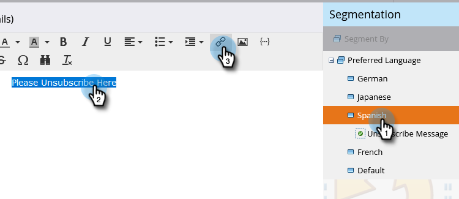

# 구독 취소 메시지를 언어에 따라 동적으로 만들기 {#make-your-unsubscribe-message-dynamic-for-languages}

기본 구독 취소 메시지 및 링크는 영어입니다. 다이내믹 콘텐츠를 사용하여 다른 언어로 표시할 수 있습니다.

>[!NOTE]
>
>이 문서는 모범 사례를 나타내지만 다른 방법으로 수행할 수 있습니다.

## 데이터 준비 {#prepare-your-data}

1. [사용자 지정 필드를 만듭니다](/help/marketo/product-docs/administration/field-management/create-a-custom-field-in-marketo.md) 이름이 &quot;기본 언어&quot;입니다. (이 필드를 동기화하려면 CRM에서 설정하십시오.)

   >[!TIP]
   >
   >앞으로 [양식을 만들기](/help/marketo/product-docs/demand-generation/forms/creating-a-form/create-a-form.md)할 때 이 필드를 사용하여 언어 기본 설정을 캡처합니다.

## 세분화 만들기 {#create-segmentation}

1. **[!UICONTROL Database]**(으)로 이동합니다.

   

1. **[!UICONTROL New]** 드롭다운에서 **[!UICONTROL New Segmentation]**&#x200B;을(를) 클릭합니다.

   

1. 세분화 이름을 **[!UICONTROL Preferred Language]**&#x200B;로 지정합니다. **[!UICONTROL Add Segment]**&#x200B;을(를) 클릭합니다. 언어를 입력합니다.

   

   >[!NOTE]
   >
   >기본 세그먼트는 영어입니다.

1. 모든 언어가 표시될 때까지 세그먼트를 계속 추가합니다. **[!UICONTROL Create]**&#x200B;를 클릭합니다.

   

1. 세그먼트를 선택하십시오.

   

1. **[!UICONTROL Smart List]** 탭으로 이동합니다. 검색 필드에 **[!UICONTROL Preferred Language]**&#x200B;을(를) 입력합니다. 필터를 캔버스에 드래그하여 놓습니다.

   

1. 적절한 해당 언어를 설정합니다.

   

1. 다른 모든 언어에 대해 이 작업을 반복합니다. 그런 다음 **[!UICONTROL Segmentation Actions]** 드롭다운을 선택하고 **[!UICONTROL Approve]**&#x200B;을(를) 클릭합니다.

   

## 스니펫 만들기 {#create-a-snippet}

1. **[!UICONTROL Design Studio]**(으)로 이동합니다.

   

1. **[!UICONTROL New]** 드롭다운에서 **[!UICONTROL New Snippet]**&#x200B;을(를) 클릭합니다.

   

1. 코드 조각 이름을 **구독 취소 메시지**&#x200B;로 지정합니다. **[!UICONTROL Create]**&#x200B;를 클릭합니다.

   

1. 기본 구독 취소 메시지를 입력하고 강조 표시한 다음 하이퍼링크 아이콘을 클릭합니다.

   

1. 이 토큰: `{{system.unsubscribeLink}}`을(를) 복사하여 **[!UICONTROL URL]** 필드에 붙여넣으십시오. **[!UICONTROL Insert]**&#x200B;를 클릭합니다.

   

1. **[!UICONTROL Segment By]** 섹션에서 **[!UICONTROL Segmentation]** 선택.

   

1. **[!UICONTROL Segmentation]** 드롭다운에서 **[!UICONTROL Preferred]**&#x200B;을(를) 입력하고 **[!UICONTROL Preferred Language]**&#x200B;을(를) 선택합니다. **[!UICONTROL Save]**&#x200B;를 클릭합니다.

   

1. 트리에서 세그먼트를 선택합니다. 구독 취소를 클릭한 다음 링크 아이콘을 클릭합니다.

   

1. `{{system.unsubscribeLink}}`이(가) **[!UICONTROL URL]** 필드에 있는지 확인하십시오. 선택한 언어와 일치하도록 **[!UICONTROL Display Text]**&#x200B;을(를) 편집합니다. **[!UICONTROL Apply]**&#x200B;를 클릭합니다.

   

1. 모든 세그먼트에 대해 이 작업을 반복합니다. 그런 다음 **[!UICONTROL Design Studio]**(으)로 돌아가서 **[!UICONTROL Snippet Actions]** 드롭다운을 클릭하고 **[!UICONTROL Approve]**&#x200B;을(를) 클릭합니다.

   

끝내주네 거의 다 됐어!

## 이메일에 코드 조각 사용 {#use-snippet-in-an-email}

1. 이메일 편집기 내에서 편집 가능한 요소를 클릭합니다. 그런 다음 톱니바퀴 아이콘을 클릭하고 **[!UICONTROL Replace with Snippet]**&#x200B;을(를) 선택합니다. 편집 가능한 코드 조각 요소를 선택하는 경우 톱니바퀴 아이콘을 클릭하고 **[!UICONTROL Edit]**&#x200B;을(를) 선택합니다.

   

1. 드롭다운에서 코드 조각을 찾아 선택하고 **[!UICONTROL Save]**&#x200B;을(를) 클릭합니다.

   

1. 테스트하려면 **[!UICONTROL Back]**&#x200B;을(를) 클릭하십시오.

   

1. ...그런 다음 **[!UICONTROL Dynamic]** 탭을 클릭합니다.

   

1. 코드 조각 변경을 보려면 다른 언어를 클릭하십시오.

   

   >[!TIP]
   >
   >물론 다이내믹 언어를 위해 나머지 이메일을 편집할 수도 있습니다. 작업하는 동안 구독 취소 페이지에서 동일한 기술을 수행합니다.

## 다이내믹 콘텐츠를 사용하여 구독 취소 페이지 맞춤화 {#customizing-your-unsubscribe-page-with-dynamic-content}

사용자가 기본 언어로 구독 취소 페이지를 방문하도록 하려면 랜딩 페이지 및 확인 페이지에서 동적 콘텐츠를 사용할 수 있습니다.

1. **[!UICONTROL Design Studio]**(으)로 이동합니다.

   

1. 검색 필드에 _구독 취소_&#x200B;를 입력하고 원하는 구독 취소 페이지를 선택합니다.

   

1. **[!UICONTROL Edit Draft]**&#x200B;를 클릭합니다.

   

1. **[!UICONTROL Segment By]**&#x200B;를 선택합니다.

   

1. **[!UICONTROL Preferred Language]** 세그먼트를 찾습니다. **[!UICONTROL Save]**&#x200B;를 클릭합니다.

   

   각 랜딩 페이지에 대한 콘텐츠를 편집하고 승인하면 바로 사용할 수 있습니다.

   >[!NOTE]
   >
   >[다이내믹 콘텐츠](/help/marketo/product-docs/personalization/segmentation-and-snippets/segmentation/understanding-dynamic-content.md) 및 수행할 수 있는 모든 멋진 작업에 대해 자세히 알아보세요.
