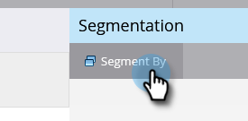
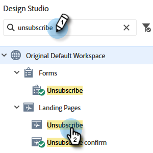

# 언어에 대해 구독 취소 메시지를 동적으로 만들기 {#make-your-unsubscribe-message-dynamic-for-languages}

기본 구독 취소 메시지 및 링크는 영어입니다. 다이내믹 콘텐츠를 사용하여 다른 언어로 표시할 수 있습니다.

>[!NOTE]
>
>이 문서는 모범 사례를 나타내지만 다른 방법으로 수행할 수 있습니다.

## 데이터 준비 {#prepare-your-data}

1. [사용자 정의 필드 만들기](/help/marketo/product-docs/administration/field-management/create-a-custom-field-in-marketo.md) &quot;기본 언어&quot;로 지정됨 (이 필드를 동기화하려면 CRM에서 설정하십시오.)

   >[!TIP]
   >
   >나중에 다음과 같은 경우에 이 필드를 사용합니다 [양식 만들기](/help/marketo/product-docs/demand-generation/forms/creating-a-form/create-a-form.md) 언어 기본 설정을 캡처합니다.

## 세분화 만들기 {#create-segmentation}

1. 로 이동 **[!UICONTROL 데이터베이스]**.

   

1. 다음에서 **[!UICONTROL 신규]** 드롭다운, 클릭 **[!UICONTROL 새 세분화]**.

   

1. 세그멘테이션 이름 지정 **[!UICONTROL 기본 언어]**. 클릭 **[!UICONTROL 세그먼트 추가]**. 언어를 입력합니다.

   

   >[!NOTE]
   >
   >기본 세그먼트는 영어입니다.

1. 모든 언어가 표시될 때까지 세그먼트를 계속 추가합니다. Click **[!UICONTROL Create]**.

   

1. 세그먼트를 선택하십시오.

   

1. 로 이동 **[!UICONTROL 스마트 목록]** 탭. 입력 **[!UICONTROL 기본 언어]** 을 검색 필드에 추가합니다. 필터를 캔버스에 드래그하여 놓습니다.

   

1. 적절한 해당 언어를 설정합니다.

   

1. 다른 모든 언어에 대해 이 작업을 반복합니다. 그런 다음 **[!UICONTROL 세분화 작업]** 드롭다운 및 클릭 **[!UICONTROL 승인]**.

   

## 코드 조각 만들기 {#create-a-snippet}

1. 로 이동 **[!UICONTROL Design Studio]**.

   

1. 다음에서 **[!UICONTROL 신규]** 드롭다운, 클릭 **[!UICONTROL 새 코드 조각]**.

   

1. 코드 조각 이름 지정 **메시지 구독 취소**. Click **[!UICONTROL Create]**.

   

1. 기본 구독 취소 메시지를 입력하고 강조 표시한 다음 하이퍼링크 아이콘을 클릭합니다.

   

1. 이 토큰 복사 및 붙여넣기: `{{system.unsubscribeLink}}` 대상: **[!UICONTROL URL]** 필드. 클릭 **[!UICONTROL 삽입]**.

   

1. 선택 **[!UICONTROL 세그먼트별]** 다음에서 **[!UICONTROL 세분화]** 섹션.

   

1. 다음에서 **[!UICONTROL 세분화]** 드롭다운, 입력 **[!UICONTROL 기본]** 및 선택 **[!UICONTROL 기본 언어]**. 클릭 **[!UICONTROL 저장]**.

   

1. 트리에서 세그먼트를 선택합니다. 구독 취소를 클릭한 다음 링크 아이콘을 클릭합니다.

   

1. 다음을 확인하십시오. `{{system.unsubscribeLink}}` 은(는) 아직 다음 위치에 있습니다. **[!UICONTROL URL]** 필드. 편집 **[!UICONTROL 텍스트 표시]** 을 눌러 선택한 언어와 일치시킵니다. 클릭 **[!UICONTROL 적용]**.

   

1. 모든 세그먼트에 대해 이 작업을 반복합니다. 그런 다음 로 돌아갑니다. **[!UICONTROL Design Studio]**&#x200B;를 클릭하고 **[!UICONTROL 코드 조각 작업]** 드롭다운을 클릭하고 **[!UICONTROL 승인]**.

   

끝내주네 거의 다 됐어!

## 이메일에 코드 조각 사용 {#use-snippet-in-an-email}

1. 이메일 편집기 내에서 편집 가능한 요소를 클릭합니다. 그런 다음 톱니바퀴 아이콘을 클릭하고 을 선택합니다 **[!UICONTROL 코드 조각으로 바꾸기]**. 편집 가능한 코드 조각 요소를 선택하는 경우 톱니바퀴 아이콘을 클릭하고 을 선택합니다 **[!UICONTROL 편집]**.

   

1. 드롭다운에서 코드 조각을 찾아 선택하고 **[!UICONTROL 저장]**.

   

1. 테스트하려면 다음을 클릭하십시오. **[!UICONTROL 뒤로]**...

   

1. ...다음 **[!UICONTROL 동적]** 탭.

   

1. 코드 조각 변경을 보려면 다른 언어를 클릭하십시오.

   

   >[!TIP]
   >
   >물론 다이내믹 언어를 위해 나머지 이메일을 편집할 수도 있습니다. 작업하는 동안 구독 취소 페이지에서 동일한 기술을 수행합니다.

## 다이내믹 콘텐츠를 사용하여 구독 취소 페이지 맞춤화 {#customizing-your-unsubscribe-page-with-dynamic-content}

사용자가 기본 언어로 구독 취소 페이지를 방문하도록 하려면 랜딩 페이지 및 확인 페이지에서 동적 콘텐츠를 사용할 수 있습니다.

1. 다음 위치로 이동 **[!UICONTROL Design Studio]**.

   

1. 입력 _구독 취소_ 검색 필드에서 원하는 구독 취소 페이지를 선택합니다.

   

1. 클릭 **[!UICONTROL 초안 편집]**.

   

1. 선택 **[!UICONTROL 세그먼트별]**.

   

1. 다음 찾기 **[!UICONTROL 기본 언어]** 세그먼트. 클릭 **[!UICONTROL 저장]**.

   

   각 랜딩 페이지에 대한 콘텐츠를 편집하고 승인하면 바로 사용할 수 있습니다.

   >[!NOTE]
   >
   >자세히 알아보기 [다이내믹 콘텐츠](/help/marketo/product-docs/personalization/segmentation-and-snippets/segmentation/understanding-dynamic-content.md) 그리고 네가 할 수 있는 멋진 일들도
