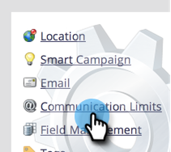
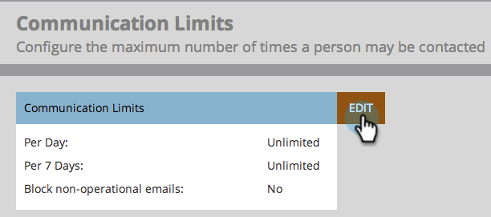
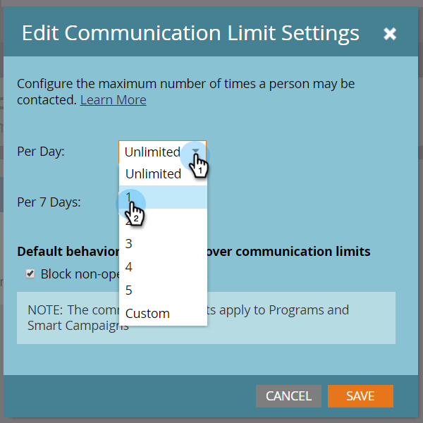
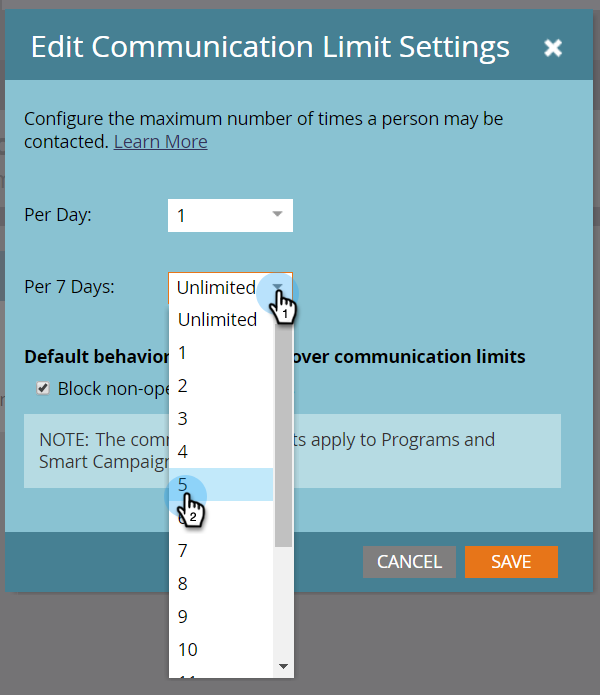
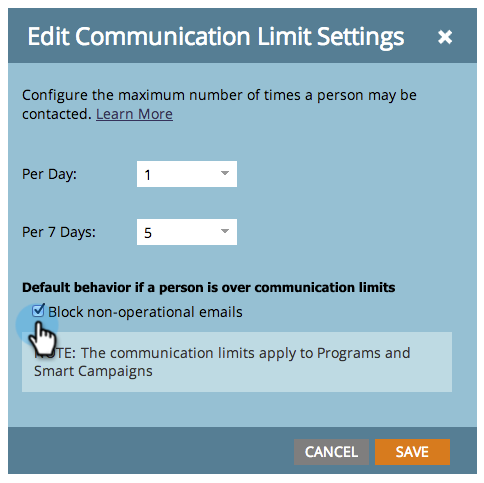
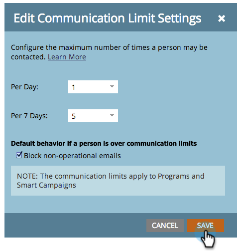

# 통신 제한 활성화 {#enable-communication-limits}

국민과 과도한 소통을 하지 않는 것이 중요하다. 통신 제한을 설정하면 조직에서 너무 많은 이메일을 보내지 못하게 됩니다.

>[!NOTE]
>
>**관리자 권한 필요**

1. **[!UICONTROL Admin]** 영역으로 이동합니다.

   

1. **[!UICONTROL Communication Limits]**&#x200B;를 클릭합니다.

   

1. **[!UICONTROL Edit]**&#x200B;를 클릭합니다.

   

   >[!NOTE]
   >
   >[!UICONTROL Per Day]은(는) 구독 시간대(자정-자정)의 역일을 기준으로 합니다.

1. **[!UICONTROL Per Day]** 드롭다운을 클릭하고 원하는 제한을 선택합니다. 이 예에서는 1이 사용되고 있습니다.

   

   >[!TIP]
   >
   >사전 설정 옵션이 작동하지 않는 경우 **[!UICONTROL Custom]**&#x200B;을(를) 선택할 수도 있습니다.

1. **[!UICONTROL Per 7 Days]** 드롭다운을 클릭하고 원하는 제한을 선택합니다. 이 예에서는 5가 사용되고 있습니다.

   

1. **[!UICONTROL Block non-operational emails]**&#x200B;를 선택합니다.

   

   >[!NOTE]
   >
   >[작동 중인 전자 메일](/help/marketo/product-docs/email-marketing/general/functions-in-the-editor/make-an-email-operational.md)에 대해 자세히 알아보세요.

1. **[!UICONTROL Save]**&#x200B;를 클릭합니다.

   

   >[!NOTE]
   >
   >**예**
   >
   >위의 설정은 사용자가 매일 **1개 이상의 전자 메일을 받지 못함을 의미합니다** 또는 7일 동안 **5개 이상의 전자 메일을 받지 못합니다**.

   >[!NOTE]
   >
   >모든 이메일 및 참여 프로그램에는 커뮤니케이션 제한이 자동으로 적용됩니다.

>[!MORELIKETHIS]
>
>[통신 제한 적용 [!DNL Smart Campaign]](/help/marketo/product-docs/core-marketo-concepts/smart-campaigns/using-smart-campaigns/apply-communication-limits-to-smart-campaign.md)
