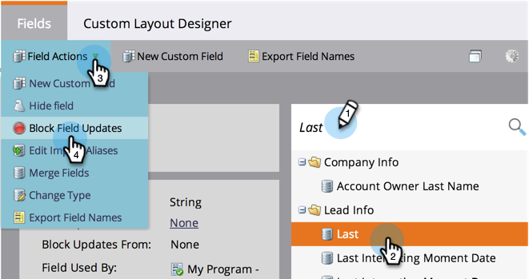

# 신뢰할 수 없는 원본에서 목록을 가져오는 동안 필드 업데이트 차단{#block-field-updates-during-list-import-from-untrusted-sources}

일부 목록의 데이터는 다른 목록보다 더 신뢰할 수 있습니다. 경우에 따라 의심스러운 데이터가 있고 필드가 비어 있는 경우 가져가려고 하지만 기존 값이 있는 경우에는 그렇지 않습니다. 키 필드에서 필드 업데이트를 차단하여 이를 수행할 수 있습니다.

>[!NOTE]
>
>**관리자 권한 필요**

## 신뢰할 수 없는 소스 {#blocking-field-updates-from-untrusted-sources}에서 필드 업데이트 차단

1. **관리**&#x200B;로 이동하고 **필드 관리**&#x200B;를 클릭합니다.

   

1. 원하는 필드를 찾아 선택한 다음 **필드 작업**&#x200B;에서 **필드 업데이트 차단**&#x200B;을 클릭합니다.

   

1. **신뢰할 수 없는 소스 가져오기**&#x200B;를 선택하고 **적용**&#x200B;을 클릭합니다.

   

>[!TIP]
>
>**신뢰할 수 있는 소스 가져오기 목록 가져오기**&#x200B;도 확인하여 모든 목록에서 신뢰할 수 있고 신뢰할 수 없는 필드를 안전하게 유지할 수 있습니다.

신뢰할 수 없는 목록으로부터 보호하려는 다른 필드에 대해 위의 단계를 반복합니다.

## 신뢰할 수 없는 목록 가져오기 실행 {#running-an-untrusted-list-import}

1. 목록 가져오기를 실행할 때 이전 단계에서 설정한 모든 필드를 안전하게 유지하려면 **Untrusted **을 선택하십시오.

   

목록 가져오기에 대한 자세한 지침은 [사람 목록 가져오기](../../../getting-started/quick-wins/import-a-list-of-people.md)를 참조하십시오.

잘했어! 이제 신뢰할 수 없는 목록에서 키 필드를 안전하게 유지하는 방법을 알 수 있습니다.
