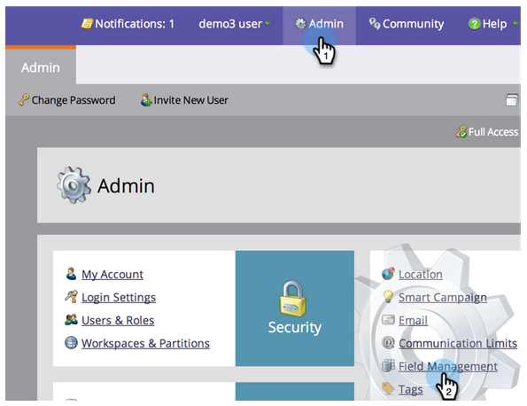

# Marketing To에서 사용자 지정 필드 만들기 {#create-a-custom-field-in-marketo}

데이터를 저장/캡처하기 위해 Marketing to에 새로운 사용자 정의 필드가 필요한 경우 이 필드를 만드는 방법을 설명합니다.

1. 관리자로 이동하고 필드 관리를 클릭합니다.

   

   >[!TIP]
   >
   >CRM과 필드를 동기화하려면 CRM에서 필드를 만들면 Marketing To에서 자동으로 생성됩니다.

1. 새 사용자 지정 필드를 클릭합니다.

   

1. 유형 필드를 선택합니다. 이렇게 하면 Marketing To의 스마트 목록 및 양식에서 렌더링되는 방식이 변경됩니다.

   >[!TIP]
   >
   >사용자 [지정 필드 유형 용어집을 확인하십시오](custom-field-type-glossary.md).

   

1. Marketing To에 표시할 이름을 입력합니다. API 이름은 자동으로 생성됩니다. 수정할 수 있지만 한 번 설정하면 이름을 변경할 수 없습니다. 완료되면 만들기를 클릭합니다.

>[!CAUTION]
>
>필드 이름은 다음 문자로 시작할 수 없습니다. **. &amp; +[]**

>[!NOTE]
>
>API 이름은 SOAP API 및 기타 백엔드 프로세스에서 사용됩니다.

이제 양식, 흐름 단계 및 스마트 목록에서 이 사용자 정의 필드를 사용할 수 있습니다.