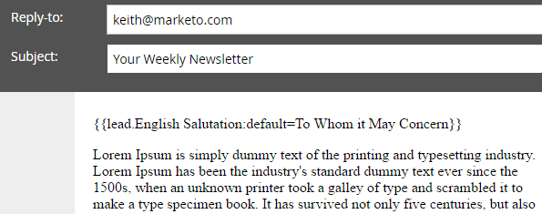

# 연결된 문자열(공식) 필드 만들기 및 사용 {#create-and-use-a-concatenated-string-formula-field}

여러 필드의 값을 결합하거나 Marketo Engage 수식 필드를 사용하여 조건부 값을 만들 수 있습니다.

1. 로 이동 **[!UICONTROL 관리자]** 영역입니다.

   

1. 클릭 **[!UICONTROL 필드 관리]**.

   

1. 클릭 **[!UICONTROL 새 사용자 정의 필드]**.

   

1. 선택 **[!UICONTROL 공식]** 대상: **[!UICONTROL 유형]**.

   

1. 입력 **[!UICONTROL 이름]** 을 클릭하여 필드를 만듭니다. **[!UICONTROL 만들기]**.

   

1. 공식 필드를 찾아 선택한 다음 **[!UICONTROL 규칙 편집]**.

   

1. 두 가지 선택 사항을 추가하고 아래 스크린샷과 같이 정의합니다.

   

   >[!TIP]
   >
   >자세히 알아보기 [흐름 단계용 토큰](/help/marketo/product-docs/core-marketo-concepts/smart-campaigns/flow-actions/use-tokens-in-flow-steps.md).

1. 이제 공식 필드를 이메일에 토큰으로 추가할 수 있습니다.

   

>[!NOTE]
>
>공식 필드는 랜딩 페이지, 이메일 및 스마트 목록 열에서 사용할 수 있습니다. 공식 필드가 있는 이메일은 _아님_ 일괄 캠페인을 사용하여 전송됩니다. 을(를) 사용하십시오. [이메일 스크립트 토큰](/help/marketo/product-docs/email-marketing/general/using-tokens/create-an-email-script-token.md) 이 시나리오에서는

잘했어요! 이제 성별에 따른 인사말이 무엇인지 아는 똑똑한 분야가 생겼습니다. 이것들로 재미있게 놀고 창의적으로 하세요.
