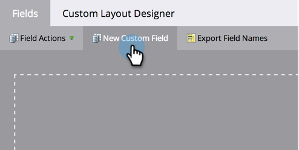

# 연결된 문자열(수식) 필드 만들기 및 사용 {#create-and-use-a-concatenated-string-formula-field}

여러 필드의 값을 결합하거나 Marketo Engage 공식 필드를 사용하여 조건부 값을 작성할 수 있습니다.

1. **[!UICONTROL Admin]** 영역으로 이동합니다.

   

1. **[!UICONTROL Field Management]**&#x200B;를 클릭합니다.

   

1. **[!UICONTROL New Custom Field]**&#x200B;를 클릭합니다.

   

1. **[!UICONTROL Formula]**&#x200B;에 대해 **[!UICONTROL Type]**&#x200B;을(를) 선택합니다.

   

1. 필드에 **[!UICONTROL Name]**&#x200B;을(를) 입력한 다음 **[!UICONTROL Create]**&#x200B;을(를) 클릭합니다.

   

1. 수식 필드를 찾아 선택한 다음 **[!UICONTROL Edit Rules]**&#x200B;을(를) 클릭합니다.

   

1. 두 가지 선택 사항을 추가하고 아래 스크린샷과 같이 정의합니다.

   

   >[!TIP]
   >
   >흐름 단계[에 대한 ](/help/marketo/product-docs/core-marketo-concepts/smart-campaigns/flow-actions/use-tokens-in-flow-steps.md)토큰에 대해 자세히 알아보세요.

1. 이제 공식 필드를 이메일에 토큰으로 추가할 수 있습니다.

   

>[!NOTE]
>
>공식 필드는 랜딩 페이지, 이메일 및 스마트 목록 열에서 사용할 수 있습니다. 수식 필드가 있는 전자 메일은 일괄 캠페인을 사용하여 _보낼 수 없습니다_. 이 시나리오에서 [전자 메일 스크립트 토큰](/help/marketo/product-docs/email-marketing/general/using-tokens/create-an-email-script-token.md)을(를) 사용하십시오.

잘했어요! 이제 성별에 따른 인사말이 무엇인지 아는 똑똑한 분야가 생겼습니다. 이것들로 재미있게 놀고 창의적으로 하세요.
