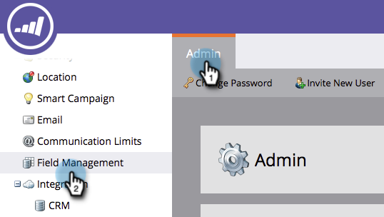

# 목록 가져오기의 필드 별칭 편집 {#edit-field-aliases-for-list-import}

헤더를 알 수 없는 목록을 가져올 때 필드 별칭을 만들어 보다 쉽게 만들 수 있습니다. 필드 관리에서 이러한 별칭을 편집할 수도 있습니다. 확인해 보십시오.

>[!NOTE]
>
>**관리자 권한 필요**

1. 관리에서 필드 관리를 클릭합니다.

   

1. 별칭을 추가할 필드를 찾아 선택합니다.

   

1. 필드 작업 아래에서 별칭 가져오기 편집을 클릭합니다.

   

1. 별칭을 입력하고 저장을 클릭합니다.

   

>[!TIP]
>
>다른 **항목** 추가를 클릭하고 필요한 경우 더 많은 별칭을 입력합니다.

이것 좀 봐! 이제 &quot;DOB&quot;라는 열이 있는 스프레드시트를 가져오면 Marketing에서 이 스프레드시트를 &quot;생년월일&quot;으로 자동 인식하고 데이터를 올바른 필드로 가져옵니다.  

