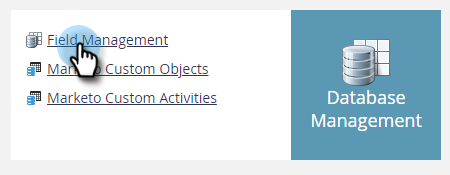

# 필드를 민감한 항목으로 표시 {#mark-a-field-as-sensitive}

Marketo 관리자는 특정 필드를 &quot;중요&quot;로 표시하여 해당 값이 양식에 미리 채워지지 않도록 함으로써 사용자의 중요한 데이터를 보호할 수 있습니다.

>[!NOTE]
>
>이 기능은 5월 11일 화요일 저녁에 모든 Marketo 인스턴스에 대해 활성화됩니다.

1. **[!UICONTROL Admin]**&#x200B;를 클릭합니다.

   

1. **[!UICONTROL Field Management]**&#x200B;를 클릭합니다.

   

1. 원하는 필드를 찾아 선택합니다.

   

1. **[!UICONTROL Mark Field as Sensitive]** 확인란을 선택합니다.

   

다 됐습니다! 앞으로, 사전 채우기가 활성화된 모든 Marketo 양식은 선택한 필드에 대한 데이터를 표시하지 않습니다.
