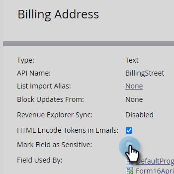

# 필드를 민감도로 표시 {#mark-a-field-as-sensitive}

Marketo 관리자는 특정 필드를 &quot;중요&quot;로 표시하여 해당 값이 양식에 미리 채워지지 않도록 함으로써 사용자의 중요한 데이터를 보호할 수 있습니다.

>[!NOTE]
>
>이 기능은 5월 11일 화요일 저녁에 모든 Marketo 인스턴스에 대해 활성화됩니다.

1. 클릭 **관리**.

   

1. 클릭 **필드 관리**.

   

1. 원하는 필드를 찾아 선택합니다.

   

1. 을(를) 선택합니다 **필드를 중요로 표시** 확인란을 선택합니다.

   

그게 다야! 앞으로, 사전 채우기로 활성화된 모든 Marketo 양식에는 선택한 필드에 대한 데이터가 표시되지 않습니다.
