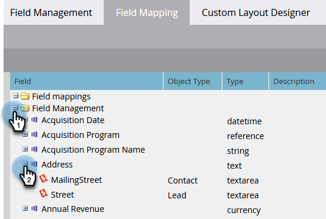

# Marketo과 [!DNL Salesforce] 간의 필드 매핑 보기 {#view-field-mappings-between-marketo-and-salesforce}

특정 Marketo 필드가 연결된 [!DNL Salesforce]개 필드를 알고 싶을 수 있습니다. 확인 방법은 다음과 같습니다.

>[!NOTE]
>
>**관리자 권한 필요**

1. **[!UICONTROL 관리자]** 영역으로 이동합니다.

   

1. **[!UICONTROL 필드 관리]**&#x200B;를 클릭합니다.

   

1. 보려는 필드를 찾은 다음 **+**&#x200B;을(를) 클릭하여 매핑을 확장합니다.

   

>[!NOTE]
>
>레이블 이름이 아닌 [!DNL Salesforce] API 이름을 표시합니다.

>[!IMPORTANT]
>
>나열된 필드는 초기 매핑의 데이터만 반영합니다. Marketo/[!DNL Salesforce] 동기화 후에는 업데이트되지 않습니다.
