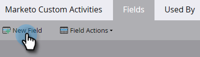
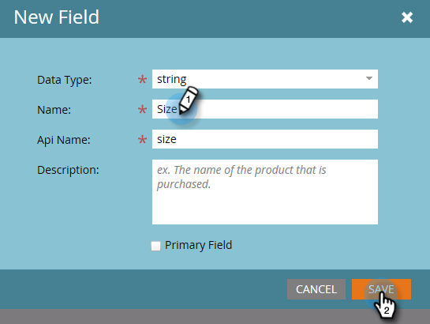

# Marketo 사용자 지정 활동 필드 추가/편집/삭제 {#add-edit-delete-marketo-custom-activity-fields}

사용자 지정 활동 필드를 추가, 변경 또는 제거해야 할 수 있습니다. 방법은 다음과 같습니다.

## 사용자 지정 활동 필드 추가 {#add-a-custom-activity-field}

1. **[!UICONTROL Admin]** 영역으로 이동합니다.

   

1. **[!UICONTROL Marketo Custom Activities]**&#x200B;을(를) 클릭합니다.

   

1. **[!UICONTROL Fields]**&#x200B;을(를) 클릭합니다.

   

1. 필드를 추가할 사용자 지정 활동을 선택합니다.

   

1. **[!UICONTROL New Field]**&#x200B;을(를) 클릭합니다.

   

1. 필드의 [!UICONTROL data type] 선택

   

   >[!TIP]
   >
   >무엇을 선택할지 확실하지 않습니까? 엄호해! 사용 가능한 모든 데이터 형식은 [이 문서](/help/marketo/product-docs/administration/field-management/custom-field-type-glossary.md)에 정의되어 있습니다.

1. 필드 이름을 지정합니다. Api 이름이 자동으로 채워집니다. 완료되면 **[!UICONTROL Save]**&#x200B;을(를) 클릭합니다.

   

   됐습니다. 새 필드가 추가되었습니다.

## 사용자 지정 활동 필드 편집 {#edit-a-custom-activity-field}

1. **[!UICONTROL Admin]** 영역으로 이동합니다.

   

1. **[!UICONTROL Marketo Custom Activities]**&#x200B;을(를) 클릭합니다.

   

1. **[!UICONTROL Fields]**&#x200B;을(를) 클릭합니다.

   

1. 편집할 필드가 포함된 사용자 지정 활동을 선택합니다.

   

1. 편집할 필드를 선택하고 **[!UICONTROL Field Actions]** 드롭다운을 클릭한 다음 **[!UICONTROL Edit Field]**&#x200B;을(를) 선택합니다.

   

   **[!UICONTROL Edit Field]** 팝업이 나타납니다. 이 예제에서는 필드의 이름을 변경해 보겠습니다.

   

1. 새 이름과 API 이름을 입력한 다음 **[!UICONTROL Save]**&#x200B;을(를) 클릭합니다.

   

   >[!NOTE]
   >
   >필드를 편집할 때 [!UICONTROL Api Name]이(가) 자동으로 채워지지 않습니다. 필드 [!UICONTROL Name]과(와) [!UICONTROL Api Name]이(가) 일치할 필요는 없지만 일치하는 것이 좋습니다.

   >[!CAUTION]
   >
   >사용자 지정 활동이 게시된 적이 없는 경우에만 API 이름을 편집하거나 필드를 기본으로 변경할 수 있습니다.

   >[!NOTE]
   >
   >기본 필드를 변경하려면 먼저 기존 필드를 선택 해제해야 합니다.

이제 필드가 편집되었습니다!

## 사용자 지정 활동 필드 삭제 {#delete-a-custom-activity-field}

1. **[!UICONTROL Admin]** 영역으로 이동합니다.

   

1. **[!UICONTROL Marketo Custom Activities]**&#x200B;을(를) 클릭합니다.

   

1. **[!UICONTROL Fields]**&#x200B;을(를) 클릭합니다.

   

1. 삭제하려는 필드가 포함된 사용자 지정 활동을 선택합니다.

   

1. 삭제할 필드를 선택하고 **[!UICONTROL Field Actions]** 드롭다운을 클릭한 다음 **[!UICONTROL Delete Field]**&#x200B;을(를) 선택합니다.

   
