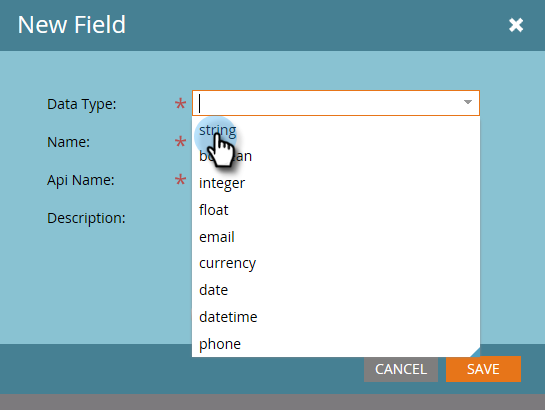

# Marketo 사용자 지정 활동 필드 추가/편집/삭제 {#add-edit-delete-marketo-custom-activity-fields}

사용자 지정 활동 필드를 추가, 변경 또는 제거해야 할 수 있습니다. 방법은 다음과 같습니다.

## 사용자 지정 활동 필드 추가 {#add-a-custom-activity-field}

1. 로 이동합니다. **관리** 영역.

   

1. 클릭 **Marketo 사용자 지정 활동**.

   

1. 클릭 **필드**.

   

1. 필드를 추가할 사용자 지정 활동을 선택합니다.

   

1. 클릭 **새 필드**.

   

1. 필드의 데이터 유형을 선택합니다.

   

   >[!TIP]
   >
   >어떤 항목을 선택해야 할지 확실하지 않습니까? 우리가 널 보호했어! 사용 가능한 모든 데이터 유형은에서 정의됩니다. [이 문서](/help/marketo/product-docs/administration/field-management/custom-field-type-glossary.md).

1. 필드 이름을 지정합니다. Api 이름 이 자동으로 채워집니다. 완료되면 을(를) 클릭합니다. **저장**.

   

   됐습니다. 새 필드가 추가되었습니다.

## 사용자 지정 활동 필드 편집 {#edit-a-custom-activity-field}

1. 로 이동합니다. **관리** 영역.

   

1. 클릭 **Marketo 사용자 지정 활동**.

   

1. 클릭 **필드**.

   

1. 편집할 필드가 포함된 사용자 지정 활동을 선택합니다.

   

1. 편집할 필드를 선택하고 **필드 작업** 드롭다운을 선택하고 을(를) 선택합니다. **필드 편집**.

   

   [필드 편집] 팝업이 나타납니다. 이 예에서 필드 이름을 변경하겠습니다.

   

1. 새 이름 및 Api 이름을 입력한 다음 를 클릭합니다 **저장**.

   

   >[!NOTE]
   >
   >필드를 편집할 때 Api 이름이 자동으로 채워지지 않습니다. 필드 이름 및 Api 이름이 일치할 필요는 없지만 확인하는 것이 좋습니다.

   >[!CAUTION]
   >
   >사용자 지정 활동이 게시되지 않은 경우에만 Api 이름을 편집하거나 필드를 기본 로 변경할 수 있습니다.

   >[!NOTE]
   >
   >기본 필드를 변경하려면 먼저 기존 필드를 선택 취소해야 합니다.

이제 필드가 편집되었습니다!

## 사용자 지정 활동 필드 삭제 {#delete-a-custom-activity-field}

1. 로 이동합니다. **관리** 영역.

   

1. 클릭 **Marketo 사용자 지정 활동**.

   

1. 클릭 **필드**.

   

1. 삭제할 필드가 포함된 사용자 지정 활동을 선택합니다.

   

1. 삭제할 필드를 선택하고 **필드 작업** 드롭다운을 선택하고 을(를) 선택합니다. **필드 삭제**.

   
