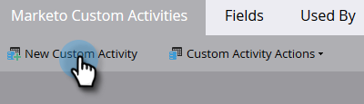

# 사용자 지정 활동 만들기 {#create-a-custom-activity}

다음 단계에 따라 새 사용자 지정 활동을 만듭니다.

>[!NOTE]
>
>대부분의 구독에는 10개의 사용자 지정 활동 유형으로 할당된 제한이 있습니다.

1. **[!UICONTROL 관리자]** 영역으로 이동합니다.

   

1. **[!UICONTROL Marketo 사용자 지정 활동]**&#x200B;을 클릭합니다.

   

1. **[!UICONTROL 새 사용자 지정 활동]**&#x200B;을 클릭합니다.

   

1. 이름과 선택적 [!UICONTROL 설명]을 입력한 다음 **[!UICONTROL 다음]**&#x200B;을 클릭합니다. API 이름이 자동으로 채워지지만 사용자 지정할 수 있습니다.

   

   >[!CAUTION]
   >
   >API 이름을 변경하는 경우, 이름이 다른 사용자 지정 활동의 필드와 충돌하지 않는지 확인하십시오.

1. [!UICONTROL 필터] 및 [!UICONTROL 트리거]를 정의하고 **[!UICONTROL 다음]**&#x200B;을(를) 클릭합니다.

   

1. 기본 필드에 사용자 정의 활동의 용도를 요약하는 이름을 지정합니다.

   

>[!MORELIKETHIS]
>
>[사용자 지정 활동 이해](/help/marketo/product-docs/administration/marketo-custom-activities/understanding-custom-activities.md)
