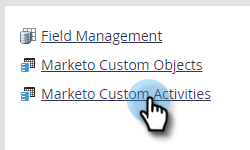

# 사용자 정의 활동 메타데이터 내보내기 {#custom-activity-metadata-export}

사용자 지정 활동 메타데이터 스키마를 내보내려면 아래 단계를 따르십시오.

1. 내 Marketo에서 **[!UICONTROL Admin]**&#x200B;을(를) 클릭합니다.

   

1. **[!UICONTROL Marketo Custom Activities]**&#x200B;를 클릭합니다.

   

1. 내보내려는 Marketo 사용자 지정 활동을 선택합니다.

   

1. **[!UICONTROL Custom Activity Actions]** 드롭다운을 클릭하고 **[!UICONTROL Export Activity]**&#x200B;를 선택합니다.

   

>[!NOTE]
>
>내보내려면 사용자 지정 활동이 승인됨 상태여야 합니다.

이제 세 가지 탭에 걸쳐 사용자 지정 활동의 스키마가 있는 스프레드시트가 있습니다.
