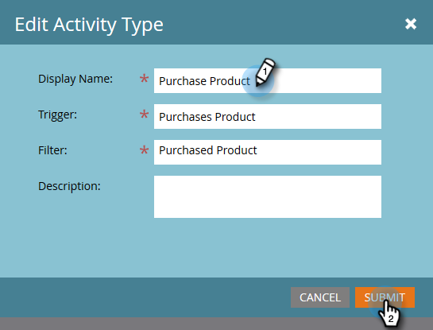

# 사용자 정의 활동 편집 {#edit-a-custom-activity}

이미 만들어진 사용자 지정 활동을 변경하려면 아래 단계를 따르십시오.

1. **[!UICONTROL Admin]** 영역으로 이동합니다.

   

1. **[!UICONTROL Marketo Custom Activities]**&#x200B;를 클릭합니다.

   

1. 편집할 사용자 지정 활동을 선택합니다.

   

1. **[!UICONTROL Custom Activity Actions]**&#x200B;을(를) 클릭하고 **[!UICONTROL Edit Activity]**&#x200B;을(를) 선택합니다.

   

   활동 유형 편집 이 나타납니다. 이 예제에서 오타가 수정되고 있습니다.

   

1. 업데이트된 정보를 입력하고 **[!UICONTROL Submit]**&#x200B;을(를) 클릭합니다.

   

   사용자 지정 활동이 업데이트되었습니다.

   >[!NOTE]
   >
   >편집 시 활동이 초안이었던 경우 초안으로 유지됩니다. 게시되면 상태가 초안과 함께 게시됨으로 변경됩니다.
