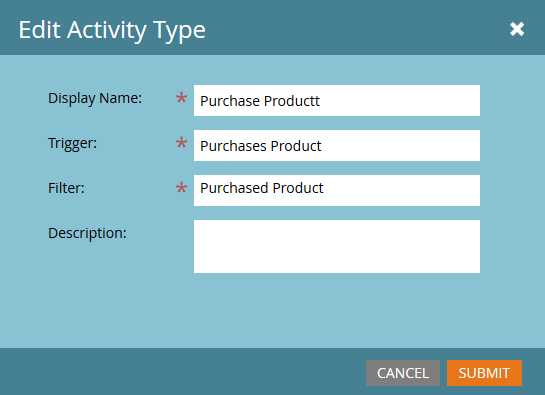

# 사용자 지정 활동 편집 {#edit-a-custom-activity}

이미 만든 사용자 지정 활동을 변경해야 합니까? 방법은 다음과 같습니다.

1. **[!UICONTROL 관리자]** 영역으로 이동합니다.

   

1. **[!UICONTROL Marketo 사용자 지정 활동]**&#x200B;을 클릭합니다.

   

1. 편집할 사용자 지정 활동을 선택합니다.

   

1. **[!UICONTROL 사용자 지정 활동 작업]**&#x200B;을 클릭하고 **[!UICONTROL 활동 편집]**&#x200B;을 선택합니다.

   

   활동 유형 편집 이 나타납니다. 이 예에서는 오타를 수정하고 있습니다.

   

1. 새 정보를 입력하고 **[!UICONTROL 제출]**&#x200B;을 클릭합니다.

   

   이제 사용자 지정 활동이 편집되었습니다!

   >[!NOTE]
   >
   >편집 시 활동이 초안이었던 경우 초안으로 유지됩니다. 게시되면 상태가 초안과 함께 게시됨으로 변경됩니다.
