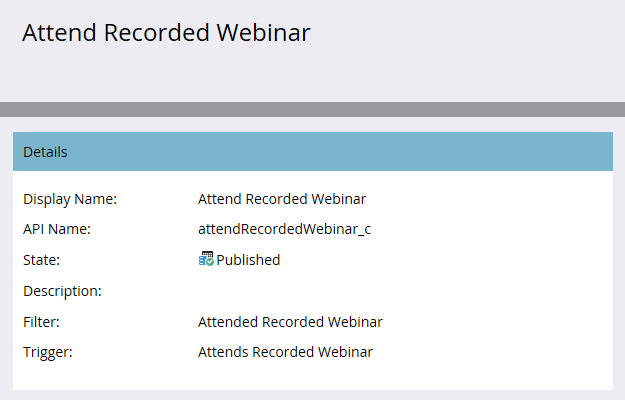

# 사용자 지정 활동 게시 {#publish-a-custom-activity}

사용자 정의 활동이 원하는 대로 정확하게 표시됩니다. 이제 게시할 차례입니다!

1. 로 이동 **[!UICONTROL 관리자]** 영역입니다.

   

1. 클릭 **[!UICONTROL Marketo 사용자 지정 활동]**.

   

1. 게시할 사용자 지정 활동을 선택합니다.

   

1. 다음을 클릭합니다. **[!UICONTROL 사용자 지정 활동 작업]** 드롭다운 및 선택 **[!UICONTROL 활동 게시]**.

   

   다음 사용자 지정 활동이 표시됩니다. [!UICONTROL 상태] 다음에서 이동 [!UICONTROL 초안]...

   

   ...으로 [!UICONTROL 게시됨].

   

   잘했어!
